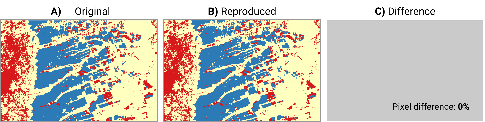

<!-- README.md is generated from README.Rmd. Please edit that file -->


```{r, include = FALSE}
knitr::opts_chunk$set(
    collapse = TRUE,
    comment = "#>",
    out.width = "100%"
)
library(tibble)
```

## Land Use and Land Cover Classification (CBERS-4/AWFI) - Bahia State/Brazil

In this example, the bdcrrm-api is used to reproduce the classification methodology presented by Ferreira *et al.* (2021) in the article [Earth Observation Data Cubes for Brazil: Requirements Methodology and Products](https://doi.org/10.3390/rs12244033). Thus, this example will produce **L**and **U**se and **L**and **C**over (LULC) map by classifying satellite image time series data extracted from a CBERS-4/AWFI data cube.

> The data cube used in this example is produced and distributed by the Brazil Data Cube (BDC) project. For more information, please see the [STAC Catalog from BDC project](https://brazildatacube.dpi.inpe.br/stac/).

### Code and Data

In this example, to create the LULC map, we will use the R SITS package, which offers ready-to-use algorithms and methods for applying the classification methodology presented by [Ferreira *et al.* (2021)](https://doi.org/10.3390/rs12244033). Included in the package are features for extracting time series from data cubes, sample analysis, and Machine Learning algorithms such as Random Forest and MultiLayer-Perceptron for time series classification.

> If you would like more information about the SITS package, please refer to the [official package documentation](https://github.com/e-sensing/sits).

As mentioned, we will use a satellite image time series extracted from the CBERS-4/AWFI data cube for the example data. The data is from the Western Bahia (bdc-tile 022024) region in Brazil from `2018-09` to `2019-07`.

> We will retrieve the CBERS-4/AWFI data used in this example from the BDC project's STAC service. This service requires an access key to use the data. If you do not have an access key, create one via BDC Explorer.

More information about the study region can be found in [Ferreira *et at* (2021)](https://doi.org/10.3390/rs12244033).

### Configuring

To perform the steps presented in this example, you will need to have an R environment with the SITS package installed and a Python environment with bdcrrm-api installed on your machine. 

For this requirement, there is a `Dockerfile` available in this example with the instructions to create a complete RStudio environment to run this example. So, to make use of it, build the image. You can do this build with the `build.sh` script:

```{sh, eval=FALSE}
./build.sh
```

After the build, the Docker Image `bdcrrm/lulc-classification-cbers:latest` will be available. Use it to start the environment. To do this, you can use the command below:

```{sh, eval=FALSE}
docker run --detach \
           --publish 127.0.0.1:8787:8787 \
           --name lulc-classification-cbers-example \
           --volume /var/run/docker.sock:/var/run/docker.sock:ro \
           bdcrrm/lulc-classification-cbers:latest
```

When you run the container, RStudio will be available on port `8787` of your computer. To use the environment, go to the address `http://127.0.0.1:8787` in your browser. For example, to open it with firefox, you can use the command:

```{sh, eval=FALSE}
firefox http://127.0.0.1:8787
```

> To login use `sits` as **user** and **password**.

If you are an **advanced user**, you can set up these environments manually. In this case, first, install R and Python. Then install the dependencies for each environment. To do this, you can use the following commands:

**Python**

```{sh, eval=FALSE}
pip install git+https://github.com/brazil-data-cube/bdcrrm-api
```

**R**

```{sh, eval=FALSE}
# install.packages('devtools')
devtools::install_github("e-sensing/sits@v0.12.0")
```

### Running

> This example will present a step-by-step guide with all the required steps to use the `bdcrrm-api`. However, if you want to perform all the steps at once, please use the `pipeline.sh` script.

Before you start running, remember to set the environment variable `BDC_ACCES_KEY` to the value of your service access key, for example:

```{sh, eval=FALSE}
export BDC_ACCESS_KEY=MY_KEY_VALUE
```

> Since `bdcrrm-api` saves all the operating system information being used, environment variables are also saved. To prevent environment variables with sensitive information such as the `BDC_ACCESS_KEY` variable from being shared improperly, `bdcrrm-api` introduced the concept of `secrets`. These filters remove all environment variables with the defined nomenclature, allowing the use of databases and web services (e.g., STAC, WTSS, and AWS) that depend on a token or user/password as environment variables without exposing credentials.

**Adding secrets**

```{sh, eval=FALSE}
bdcrrm project settings secrets add BDC_ACCESS_KEY
```

After the secret definition, the scripts can be run through `bdcrrm-api`:

**1. Extracting time series**

```{sh, eval=FALSE}
bdcrrm-cli production make Rscript analysis/01_extract_ts.R

#> bdcrrm-cli: Reproducible execution
#> SITS - satellite image time series analysis.
#> Loaded sits v0.12.0.
#>         See ?sits for help, citation("sits") for use in publication.
#>         See demo(package = "sits") for examples.
#> Using configuration file: /home/felipe/R/x86_64-pc-linux-gnu-library/4.0/sits/extdata/config.yml
#> To provide additional configurations, create an yml file and set environment variable SITS_USER_CONFIG_FILE to point to it
#> All points have been retrieved
#> Some files were read and then written. We will only pack the final version of the file; reproducible experiments shouldn't change their input files
#> Configuration file written in .bdcrrm/executions/531366cc-2a0b-4b9e-89f4-8f5f5e3ee975/config.yml
#> Edit that file then run the packer -- use 'reprozip pack -h' for help
```

**2. Training the Maching Learning model**

```{sh, eval=FALSE}
bdcrrm-cli production make Rscript analysis/02_training_model.R

#> SITS - satellite image time series analysis.
#> Loaded sits v0.12.0.
#>         See ?sits for help, citation("sits") for use in publication.
#>         See demo(package = "sits") for examples.
#> Using configuration file: /home/felipe/R/x86_64-pc-linux-gnu-library/4.0/sits/extdata/config.yml
#> To provide additional configurations, create an yml file and set environment variable SITS_USER_CONFIG_FILE to point to it
#> Some files were read and then written. We will only pack the final version of the file; reproducible experiments shouldn't change their input files
#> Configuration file written in .bdcrrm/executions/9e6397a3-32ea-4c62-932a-28cad207bb87/config.yml
#> Edit that file then run the packer -- use 'reprozip pack -h' for help
```

**3. Classify time-series extracted from the CBERS Data Cube**

```{sh, eval=FALSE}
bdcrrm-cli production make Rscript analysis/03_classify.R

#> SITS - satellite image time series analysis.
#> Loaded sits v0.12.0.
#>         See ?sits for help, citation("sits") for use in publication.
#>         See demo(package = "sits") for examples.
#> Using configuration file: /home/felipe/R/x86_64-pc-linux-gnu-library/4.0/sits/extdata/config.yml
#> To provide additional configurations, create an yml file and set environment variable SITS_USER_CONFIG_FILE to point to it
#> Some files were read and then written. We will only pack the final version of the file; reproducible experiments shouldn't change their input files
#> Configuration file written in .bdcrrm/executions/98eaf6f5-88cb-4a2e-8bec-a8531cf18b66/config.yml
#> Edit that file then run the packer -- use 'reprozip pack -h' for help
```

Now, when viewing the general project information, you have:

```{sh, eval=FALSE}
bdcrrm-cli project info --graph

#> bdcrrm-cli: Project details
#> Name:
#>          lulc-classification-cbers
#> Description:
#>          Reproducible Land Use and Land Cover classification for CBERS-4/AWFI Data Cube, using the SITS analytical R package.
#> Author:
#>          Felipe Menino (felipe.carlos@inpe.br)
#> Created at:
#>          2021-08-05 00:06:40.747788
#> Execution Graph:
#> * 0 (Rscript analysis/01_extract_ts.R)
#> * 1 (Rscript analysis/02_training_model.R)
#> * 2 (Rscript analysis/03_classify.R)
```

Finally, the project can be exported and shared, which allows others to reproduce the project and its results.

```{sh, eval=FALSE}
bdcrrm-cli project shipment export --output-dir lulc_classification_project

#> bdcrrm-cli: Project Export
#> bdcrrm-cli: Validating the project...
#> bdcrrm-cli: Exporting the project!
#> bdcrrm-cli: Finished!
```

### Comparing results

To confirm that the reproduced results are the same as those generated in the original experiments, we will compare the two generated LULC maps below. So, initially, the saved project (in `.zip` format) is imported as a new project:

```{sh, eval=FALSE}
bdcrrm-cli project shipment import -f lulc_classification_project/lulc-classification-cbers.zip -d imported_project
```

The imported project and its contents are available in the directory `imported_project/lulc-classification-cbers`:

```{sh, eval=FALSE}
cd imported_project/lulc-classification-cbers
```

In this directory, you can retrieve the project information as well as re-execute the project. For the second case, you will need to configure the `secrets' removed from the package. When you look at the project secrets, you have:

```{sh, eval=FALSE}
bdcrrm-cli project settings secrets list

#> bdcrrm-cli: Secrets settings
#> bdcrrm-cli: Listing secrets
#> Project Secrets              
#> └── BDC_ACCESS_KEY 
```

As expected, the value of the environment variable `BDC_ACCESS_KEY` is not available in the package and needs to be set before reproducing the results. Therefore, it is necessary to create a file and then insert the name of the environment variables and their respective values in each line. In `bdcrrm-api`, this file is already created at import time in the root of the imported project with the name **secrets**. In this file, all the variables needed to re-run the project are listed:

```{sh, eval=FALSE}
cat secrets

#> BDC_ACCESS_KEY
```

In this case, only `BDC_ACCESS_KEY` needs to be set, so go to the **secrets** file and fill in its value with your access key to the BDC services.

```{sh, eval=FALSE}
cat secrets

#> BDC_ACCESS_KEY=YOU_BDC_ACCESS_TOKEN
```

After this, the reproduction can be performed:

```{sh, eval=FALSE}
bdcrrm-cli reproduction make -s secrets

#> bdcrrm-cli: Project reproduction.
#> bdcrrm-cli: Loading required secrets.
#> bdcrrm-cli: Reproducing the project.
#> Reproducing: Rscript analysis/01_extract_ts.R
#> Checksum: 1220c374e5b79028bf289bbec133fb313124a3cb1188a27c4870b7fe76895dc49ca7
#> Reproducing: Rscript analysis/02_training_model.R
#> Checksum: 1220967f9b7774deeb4f3a02f90fc11b28e8c2bf24700b8f2880dbdb036a4cb365df
#> Reproducing: Rscript analysis/03_classify.R
#> Checksum: 1220f7042918de0c38ced6d5925d5234ae770240c63be98e8c000a2719498cdceac6
```

At the end of the processing, the results will be available in the `results` directory. When comparing the LULC map generated in the original run and the reproduction run, you have:

```{r differences, echo=FALSE, out.width="95%", fig.align='center'}

```

The results are the same, indicating that even when run in different environments, the functionalities offered by `bdcrrm-api` help reproduce the results.
