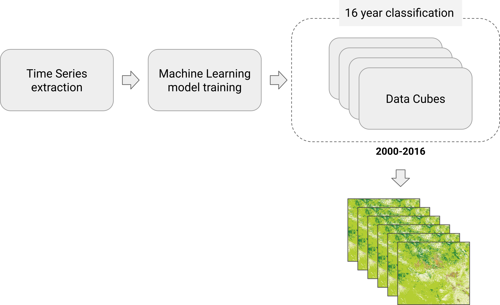
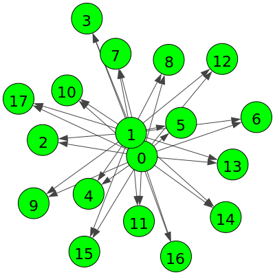
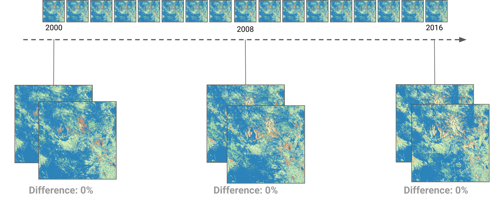

<!-- README.md is generated from README.Rmd. Please edit that file -->

## Land Use and Land Cover Classification (MOD13Q1) - Mato Grosso State/Brazil

In this example, the `bdcrrm-api` is used to create a reproducible
reusage of the classification workflow and data presented by Simoes *et
al.* (2021) in the article [Land use and cover maps for Mato Grosso
State in Brazil from 2001 to
2017](https://doi.org/10.1038/s41597-020-0371-4). Thus, this example
will produce anual **L**and **U**se and **L**and **C**over (LULC) from
`2000` to `2016`, for the Mato Grosso in Brazil by classifying satellite
image time series data extracted from the MOD13Q1 data cube.

The Figure below shows the processing workflow implemented in this
example. As you can see, first, the time series extraction is performed.
Then, using the extracted time series data, a Support Vector Machine
model is trained. Finally, the trained model is applied to generate the
annual LULC maps.

<div align="center">



</div>

The data is extracted considering all the years in the time series
extraction step. Thus, each time series extracted in this step has data
ranging from 2000 to 2016. Then, the trained model is applied
individually for each year to do the annual classification.

> The data cube used in this example is produced and distributed by the
> Brazil Data Cube (BDC) project. For more information, please see the
> [STAC Catalog from BDC
> project](https://brazildatacube.dpi.inpe.br/stac/).

### Code and Data

In this example, to create the time series of LULC map, we will use the
R SITS package, which offers ready-to-use algorithms and methods for
applying the classification workflow presented by [Simoes *et al.*
(2021)](https://doi.org/10.1038/s41597-020-0371-4). Included in the
package are features for extracting time series from data cubes, sample
analysis, and Machine Learning algorithms such as Random Forest and
MultiLayer-Perceptron for time series classification.

> If you would like more information about the SITS package, please
> refer to the [official package
> documentation](https://github.com/e-sensing/sits).

For the data, as mentioned, we will use satellite image time series
extracted from the MOD13Q1 data cube. The data is from the Mato Grosso
State (bdc-tile 012010) region from 2000 to 2016.

> We will retrieve the MOD13Q1 data used in this example from the BDC
> project’s STAC service. This service requires an access key to use the
> data. If you do not have an access key, create one via BDC Explorer.

More information about the study region can be found in [Simoes *et at*
(2021)](https://doi.org/10.1038/s41597-020-0371-4).

### Configuring

To perform the steps presented in this example, you will need to have an
R environment with the SITS package installed and a Python environment
with bdcrrm-api installed on your machine.

For this requirement, there is a `Dockerfile` available in this example
with the instructions to create a complete RStudio environment to run
this example. So, to make use of it, build the image. You can do this
build with the `build.sh` script:

``` sh
./build.sh
```

After the build, the Docker Image
`bdcrrm/lulc-classification-modis:latest` will be available. Use it to
start the environment. To do this, you can use the command below:

``` sh
docker run --detach \
           --publish 127.0.0.1:8787:8787 \
           --name lulc-classification-modis-example \
           --volume /var/run/docker.sock:/var/run/docker.sock:ro \
           bdcrrm/lulc-classification-modis:latest
```

When you run the container, RStudio will be available on port `8787` of
your computer. To use the environment, go to the address
`http://127.0.0.1:8787` in your browser. For example, to open it with
firefox, you can use the command:

``` sh
firefox http://127.0.0.1:8787
```

> To login use `sits` as **user** and **password**.

If you are an **advanced user**, you can set up these environments
manually. In this case, first, install R and Python. Then install the
dependencies for each environment. To do this, you can use the following
commands:

**Python**

``` sh
pip install git+https://github.com/brazil-data-cube/bdcrrm-api
```

**R**

``` sh
# install.packages('devtools')
devtools::install_github("e-sensing/sits@v0.12.0")
```

### Running

Before you start running, remember to set the environment variable
`BDC_ACCES_KEY` to the value of your service access key, for example:

``` sh
export BDC_ACCESS_KEY=MY_KEY_VALUE
```

> Since `bdcrrm-api` saves all the operating system information being
> used, environment variables are also saved. To prevent environment
> variables with sensitive information such as the `BDC_ACCESS_KEY`
> variable from being shared improperly, `bdcrrm-api` introduced the
> concept of `secrets`. These filters remove all environment variables
> with the defined nomenclature, allowing the use of databases and web
> services (e.g., STAC, WTSS, and AWS) that depend on a token or
> user/password as environment variables without exposing credentials.

**Adding secrets**

``` sh
bdcrrm project settings secrets add BDC_ACCESS_KEY
```

After the secret definition, the classification scripts can be run
through `bdcrrm-api`.

**Running the pipeline**

For the reproducible generation of the LULC maps, we will use the
`pipeline.sh` script. In this script are all the steps of the processing
workflow presented above. This way, initially, the extraction of the
time series is done. Next, the SVM is trained, and finally, the annual
LULC maps are generated.

Each of these steps will be performed by individual scripts. This
operation mode generates a unique execution for each step. Thus, for the
annual generation of the LULC maps, the classification script is run
individually for each year.

> The division into multiple runs is done for two reasons: (i) Ease of
> management; (ii) Control of the environment and changes, should these
> be necessary.

With this way of working, at the end of the execution, the bdcrrm-api
will have saved 18 steps (2 steps for time series extraction and SVM
training and others 16 steps of classification, one for each year). It
is important to note this way of working since this influences how
bdcrrm-api helps the reproducibility of the generated results.

**1. Configuring the environment variable**

To run the script, first access it and modify the environment variable
`BDC_ACCESS_KEY`, which will be used to access the BDC STAC service.

``` sh
cat pipeline.sh

#> #!/bin/bash

#> #
#> # General definitions
#> #
#> export BDC_ACCESS_KEY=""
```

After the modification:

``` sh
cat pipeline.sh

#> #!/bin/bash

#> #
#> # General definitions
#> #
#> export BDC_ACCESS_KEY="YOUR_BDC_ACCESS_KEY_HERE"
```

**2. Run the classification workflow**

> **Note**: This process can be time consuming! We run with a machine
> with 84 GB RAM and 32 cores, and the classification took about 6 hours
> to finish!

``` sh
./pipeline.sh
```

After the classification, bdcrrm-api will have saved all the information
needed for reproducibility. To begin the checks, let’s first look at the
execution graph that it created:

``` sh
bdcrrm-cli project info --graph

#> bdcrrm-cli: Project details
#> Name:
#>          lulc-classification-modis
#> Description:
#>          Reproducible Land Use and Land Cover Classification using MOD13Q1 Data Cube
#> Author:
#>          Felipe Menino (felipe.carlos@inpe.br)
#> Created at:
#>          2021-08-06 10:08:04
#> Execution Graph: 
```

<details>
<summary>
Click here to visualize the execution graph
</summary>

    *-----------------------------.   0 (Rscript analysis/01_extract-ts.R)
    |\ \ \ \ \ \ \ \ \ \ \ \ \ \ \ \  
    | \ \ \ \ \ \ \ \ \ \ \ \ \ \ \ \                               
    |  \ \ \ \ \ \ \ \ \ \ \ \ \ \ \ \                              
    |   \ \ \ \ \ \ \ \ \ \ \ \ \ \ \ \                             
    |    \ \ \ \ \ \ \ \ \ \ \ \ \ \ \ \                            
    |     \ \ \ \ \ \ \ \ \ \ \ \ \ \ \ \                           
    |      \ \ \ \ \ \ \ \ \ \ \ \ \ \ \ \                          
    |       \ \ \ \ \ \ \ \ \ \ \ \ \ \ \ \                         
    |        \ \ \ \ \ \ \ \ \ \ \ \ \ \ \ \                        
    |         \ \ \ \ \ \ \ \ \ \ \ \ \ \ \ \                       
    |          \ \ \ \ \ \ \ \ \ \ \ \ \ \ \ \                      
    |           \ \ \ \ \ \ \ \ \ \ \ \ \ \ \ \                     
    |            \ \ \ \ \ \ \ \ \ \ \ \ \ \ \ \                    
    |             \ \ \ \ \ \ \ \ \ \ \ \ \ \ \ \                   
    |              \ \ \ \ \ \ \ \ \ \ \ \ \ \ \ \                  
    |               \ \ \ \ \ \ \ \ \ \ \ \ \ \ \ \                 
    |                \ \ \ \ \ \ \ \ \ \ \ \ \ \ \ \                
    |                 \ \ \ \ \ \ \ \ \ \ \ \ \ \ \ \               
    |                  \ \ \ \ \ \ \ \ \ \ \ \ \ \ \ \              
    |                   \ \ \ \ \ \ \ \ \ \ \ \ \ \ \ \             
    |                    \ \ \ \ \ \ \ \ \ \ \ \ \ \ \ \            
    |                     \ \ \ \ \ \ \ \ \ \ \ \ \ \ \ \           
    |                      \ \ \ \ \ \ \ \ \ \ \ \ \ \ \ \          
    |                       \ \ \ \ \ \ \ \ \ \ \ \ \ \ \ \         
    |                        \ \ \ \ \ \ \ \ \ \ \ \ \ \ \ \        
    |                         \ \ \ \ \ \ \ \ \ \ \ \ \ \ \ \       
    |                          \ \ \ \ \ \ \ \ \ \ \ \ \ \ \ \      
    |                           \ \ \ \ \ \ \ \ \ \ \ \ \ \ \ \     
    |                            \ \ \ \ \ \ \ \ \ \ \ \ \ \ \ \    
    *---------------------------. \ \ \ \ \ \ \ \ \ \ \ \ \ \ \ \   1 (Rscript analysis/02_training_model.R)
    |\ \ \ \ \ \ \ \ \ \ \ \ \ \ \ \ \ \ \ \ \ \ \ \ \ \ \ \ \ \ \  
    | |_|_|_|_|_|_|_|_|_|_|_|_|_|_|/ / / / / / / / / / / / / / / /  
    |/| | | | | | | | | | | | | | | / / / / / / / / / / / / / / /   
    | | |_|_|_|_|_|_|_|_|_|_|_|_|_|/ / / / / / / / / / / / / / /    
    | |/| | | | | | | | | | | | | | / / / / / / / / / / / / / /     
    | | | |_|_|_|_|_|_|_|_|_|_|_|_|/ / / / / / / / / / / / / /      
    | | |/| | | | | | | | | | | | | / / / / / / / / / / / / /       
    | | | | |_|_|_|_|_|_|_|_|_|_|_|/ / / / / / / / / / / / /        
    | | | |/| | | | | | | | | | | | / / / / / / / / / / / /         
    | | | | | |_|_|_|_|_|_|_|_|_|_|/ / / / / / / / / / / /          
    | | | | |/| | | | | | | | | | | / / / / / / / / / / /           
    | | | | | | |_|_|_|_|_|_|_|_|_|/ / / / / / / / / / /            
    | | | | | |/| | | | | | | | | | / / / / / / / / / /             
    | | | | | | | |_|_|_|_|_|_|_|_|/ / / / / / / / / /              
    | | | | | | |/| | | | | | | | | / / / / / / / / /               
    | | | | | | | | |_|_|_|_|_|_|_|/ / / / / / / / /                
    | | | | | | | |/| | | | | | | | / / / / / / / /                 
    | | | | | | | | | |_|_|_|_|_|_|/ / / / / / / /                  
    | | | | | | | | |/| | | | | | | / / / / / / /                   
    | | | | | | | | | | |_|_|_|_|_|/ / / / / / /                    
    | | | | | | | | | |/| | | | | | / / / / / /                     
    | | | | | | | | | | | |_|_|_|_|/ / / / / /                      
    | | | | | | | | | | |/| | | | | / / / / /                       
    | | | | | | | | | | | | |_|_|_|/ / / / /                        
    | | | | | | | | | | | |/| | | | / / / /                         
    | | | | | | | | | | | | | |_|_|/ / / /                          
    | | | | | | | | | | | | |/| | | / / /                           
    | | | | | | | | | | | | | | |_|/ / /                            
    | | | | | | | | | | | | | |/| | / /                             
    | | | | | | | | | | | | | | | |/ /                              
    | | | | | | | | | | | | | | |/| /                               
    | | | | | | | | | | | | | | | |/                                
    * | | | | | | | | | | | | | | | 2 (Rscript analysis/03_classify.R 1)
     / / / / / / / / / / / / / / /  
    * | | | | | | | | | | | | | | 3 (Rscript analysis/03_classify.R 2)
     / / / / / / / / / / / / / /  
    * | | | | | | | | | | | | | 4 (Rscript analysis/03_classify.R 3)
     / / / / / / / / / / / / /  
    * | | | | | | | | | | | | 5 (Rscript analysis/03_classify.R 4)
     / / / / / / / / / / / /  
    * | | | | | | | | | | | 6 (Rscript analysis/03_classify.R 5)
     / / / / / / / / / / /  
    * | | | | | | | | | | 7 (Rscript analysis/03_classify.R 6)
     / / / / / / / / / /  
    * | | | | | | | | | 8 (Rscript analysis/03_classify.R 7)
     / / / / / / / / /  
    * | | | | | | | | 9 (Rscript analysis/03_classify.R 8)
     / / / / / / / /  
    * | | | | | | | 10 (Rscript analysis/03_classify.R 9)
     / / / / / / /  
    * | | | | | | 11 (Rscript analysis/03_classify.R 10)
     / / / / / /  
    * | | | | | 12 (Rscript analysis/03_classify.R 11)
     / / / / /  
    * | | | | 13 (Rscript analysis/03_classify.R 12)
     / / / /  
    * | | | 14 (Rscript analysis/03_classify.R 13)
     / / /  
    * | | 15 (Rscript analysis/03_classify.R 14)
     / /  
    * | 16 (Rscript analysis/03_classify.R 15)
     /  
    * 17 (Rscript analysis/03_classify.R 16)

</details>

<br>

We can also see the graph as a table, which summarizes the node commands
and their status.

``` sh
bdcrrm-cli project graph show --as-table-status

#> bdcrrm-cli: Graph visualization
```

<details>
<summary>
Click here to visualize the execution graph as a table
</summary>

                       Execution vertices status                   
    ┏━━━━━━━━━━━┳━━━━━━━━━━━━━━━━━━━━━━━━━━━━━━━━━━━━━━┳━━━━━━━━━━┓
    ┃ Vertex ID ┃               Command                ┃  Status  ┃
    ┡━━━━━━━━━━━╇━━━━━━━━━━━━━━━━━━━━━━━━━━━━━━━━━━━━━━╇━━━━━━━━━━┩
    │     0     │   Rscript analysis/01_extract_ts.R   │ updated✔ │
    │     1     │ Rscript analysis/02_training_model.R │ updated✔ │
    │     2     │   Rscript analysis/03_classify.R 1   │ updated✔ │
    │     3     │   Rscript analysis/03_classify.R 2   │ updated✔ │
    │     4     │   Rscript analysis/03_classify.R 3   │ updated✔ │
    │     5     │   Rscript analysis/03_classify.R 4   │ updated✔ │
    │     6     │   Rscript analysis/03_classify.R 5   │ updated✔ │
    │     7     │   Rscript analysis/03_classify.R 6   │ updated✔ │
    │     8     │   Rscript analysis/03_classify.R 7   │ updated✔ │
    │     9     │   Rscript analysis/03_classify.R 8   │ updated✔ │
    │    10     │   Rscript analysis/03_classify.R 9   │ updated✔ │
    │    11     │  Rscript analysis/03_classify.R 10   │ updated✔ │
    │    12     │  Rscript analysis/03_classify.R 11   │ updated✔ │
    │    13     │  Rscript analysis/03_classify.R 12   │ updated✔ │
    │    14     │  Rscript analysis/03_classify.R 13   │ updated✔ │
    │    15     │  Rscript analysis/03_classify.R 14   │ updated✔ │
    │    16     │  Rscript analysis/03_classify.R 15   │ updated✔ │
    │    17     │  Rscript analysis/03_classify.R 16   │ updated✔ │
    └───────────┴──────────────────────────────────────┴──────────┘

</details>

<br>

Alternatively, we can view the graph as a figure

``` sh
bdcrrm-cli project graph plot -f lulc-classification-modis.png

#> bdcrrm-cli: Graph visualization
#> bdcrrm-cli: Creating the plot...
#> bdcrrm-cli: Plot created on lulc-classification-modis.png
#> bdcrrm-cli: Finished!
```

<details>
<summary>
Click here to visualize the execution graph as a figure
</summary>

<div align="center">



</div>

</details>

<br>

Finally, the project can be exported and shared, which allows others to
reproduce the project and its results.

``` sh
bdcrrm-cli project shipment export --output-dir lulc_classification_modis

#> bdcrrm-cli: Project Export
#> bdcrrm-cli: Validating the project...
#> bdcrrm-cli: Exporting the project!
#> bdcrrm-cli: Finished!
```

### Comparing results

To confirm that the reproduced results are the same as those generated
in the original experiments, we will compare the two generated LULC maps
below. So, initially, the saved project (in `.zip` format) is imported
as a new project:

``` sh
bdcrrm-cli project shipment import -f lulc_classification_modis/lulc-classification-modis.zip -d imported_project
```

The imported project and its contents are available in the directory
`imported_project/lulc-classification-modis`:

``` sh
cd imported_project/lulc-classification-modis
```

In this directory, you can retrieve the project information as well as
re-execute the project. For the second case, you will need to configure
the `secrets` removed from the package. When you look at the project
secrets, you have:

``` sh
bdcrrm-cli project settings secrets list

#> bdcrrm-cli: Secrets settings
#> bdcrrm-cli: Listing secrets
#> Project Secrets              
#> └── BDC_ACCESS_KEY 
```

As expected, the value of the environment variable `BDC_ACCESS_KEY` is
not available in the package and needs to be set before reproducing the
results. Therefore, it is necessary to create a file and then insert the
name of the environment variables and their respective values in each
line. In `bdcrrm-api`, this file is already created at import time in
the root of the imported project with the name **secrets**. In this
file, all the variables needed to re-run the project are listed:

``` sh
cat secrets

#> BDC_ACCESS_KEY
```

In this case, only `BDC_ACCESS_KEY` needs to be set, so go to the
**secrets** file and fill in its value with your access key to the BDC
services.

``` sh
cat secrets

#> BDC_ACCESS_KEY=YOU_BDC_ACCESS_TOKEN
```

After this, the reproduction can be performed:

``` sh
bdcrrm-cli reproduction make -s secrets

#> bdcrrm-cli: Project reproduction.
#> bdcrrm-cli: Loading required secrets.
#> bdcrrm-cli: Reproducing the project.
#> Reproducing: Rscript analysis/01_extract_ts.R
#> Checksum: 1220c374e5b79028bf289bbec133fb313124a3cb1188a27c4870b7fe76895dc49ca7
#> Reproducing: Rscript analysis/02_training_model.R
#> Checksum: 1220967f9b7774deeb4f3a02f90fc11b28e8c2bf24700b8f2880dbdb036a4cb365df
#> Reproducing: Rscript analysis/03_classify.R 1
#> Checksum: 1220f9d1de1b17e92a7e4a54252128c4206b1112ec4ef9f9b920dea17cc746bbba12
#> ... (Omitted)
```

At the end of the processing, the results will be available in the
`results` directory. When comparing the LULC map generated in the
original run and the reproduction run, you have:



The results are the same, indicating that even when run in different
environments, the functionalities offered by `bdcrrm-api` help reproduce
the results.
