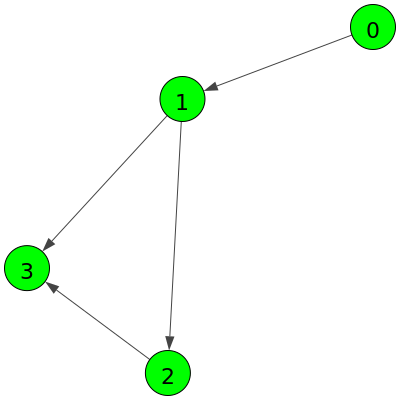
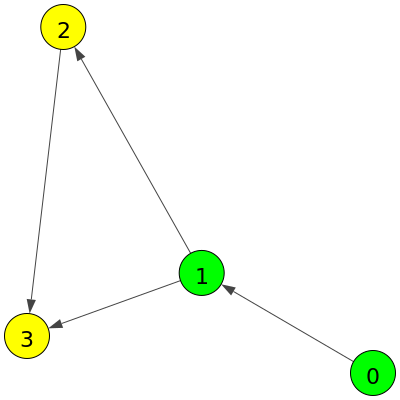
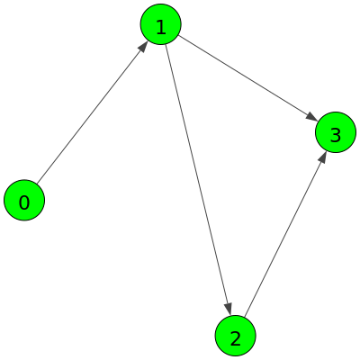

<!-- README.md is generated from README.Rmd. Please edit that file -->

```{r, include = FALSE}
knitr::opts_chunk$set(
    collapse = TRUE,
    comment = "#>",
    out.width = "100%"
)
library(tibble)
```
## MiniTour

This example presents and introduces the main aspects of using `bdcrrm-api`. To do this, the example will use simple scripts that write `txt` files.

> Even with the simplicity, you will explore all aspects of using the tool.

### Producing a reproducible example

The first step will be to explore the bdcrrm-api project created for this example. First, you can retrieve the information in this project through the `project` menu of the command line tool:

```shell
bdcrrm-cli project

#> Usage: bdcrrm-cli project [OPTIONS] COMMAND [ARGS]...
#>
#>   Project commands.
#>
#> Options:
#>   --help  Show this message and exit.
#>
#> Commands:
#>  graph     Manage the Project Execution Graph.
#>  info      Show general details about the current project.
#>  init      Initialize a new Brazil Data Cube Reproducible Research project.
#>  inputs    Check the experiment required inputs.
#>  settings  Project Settings.
#>  shipment  Project Shipment.
```

The command returned several options. All of these can be used for creating, managing, and exporting `bdcrrm-api` projects. For example, to retrieve the general information of the current project, which is linked to this directory, use:

```shell
bdcrrm-cli project info

#> bdcrrm-cli: Project details
#> Name:
#>         cook
#> Description:
#>          Example of reproducible project using Python programming language and bdcrrm-api.
#> Author:
#>          Felipe Menino
#> Created at:
#>          2021-08-04 00:06:40.747788
```

> The `--graph` flag indicates that the project execution graph should also be presented in the project information summary.

In a `bdcrrm-api` project, an execution graph is associated, where the vertices represent the executed commands and the edges represent the relations of each command. Three main elements are associated with a vertex:

- **Inputs**: The files and environment variables used by the command to generate the results;
- **Outputs**: The files that were generated by the executed command;
- **Computational Environment**: All the elements of the computer system used by the command to generate the results (e.g., OS libraries, python scripts, etc.).

Based on these elements, especially the **inputs** and **outputs**, `bdcrrm-api` does the edge generation, where there is an edge between two command vertices when the output files from one vertex are used as input by another vertex. Thus, you can generate a complete execution graph. In addition, the order in which the commands were executed is preserved, allowing the understanding of the results generation pipeline.

In addition, since each vertex has all the elements of the computational environment necessary for its execution associated with it, even after modifications to the original system, it is possible to reproduce the results.

> For capturing the environments, `bdcrrm-api` relies on the shoulder of giants, and uses the features implemented in [ReproZip](https://www.reprozip.org/).

To add commands to the execution graph, you have to run the script through `bdcrrm-api`. This means that all commands run in a terminal can be run through `bdcrrm-api` (e.g., papermill, python scripts, R scripts, and so on). In this example, there are four files in the `scripts` directory in the Python programming language to exemplify how this is done. Each of these scripts generates a file in `txt` format used as input by the subsequent script.

To exemplify the construction of a project execution graph, we will first run each of the scripts from the example directory:

**1. Running the first script**

The first line of the output below is the `bdcrrm-api` message informing you of the operation being performed. Then the next two lines have information generated by the script running, in this case, `scripts/script_1.py`. Now, with the result of the first script generated, the same steps are repeated for the other scripts.

```shell
bdcrrm-cli production make python3 scripts/script_1.py

#> bdcrrm-cli: Reproducible execution
#> Today we will eat together 🍲
#> 1: Let's start with some fruits (🍇 🍈 🍉)
#> Configuration file written in .bdcrrm/executions/fb37e364-b890-4513-b55e-b8ae514351e1/config.yml
#> Edit that file then run the packer -- use 'reprozip pack -h' for help
```

**2. Running the second script**
```shell
bdcrrm-cli production make python3 scripts/script_2.py

#> bdcrrm-cli: Reproducible execution
#> 2: Now the bread (🍞 🍞 🍞)
#> Configuration file written in .bdcrrm/executions/1bf457fd-ee1c-436d-900f-b80233ab2582/config.yml
#> Edit that file then run the packer -- use 'reprozip pack -h' for help
```

**3. Running the third script**
```shell
bdcrrm-cli production make python3 scripts/script_3.py

#> bdcrrm-cli: Reproducible execution
#> 3: Tacos and burritos!!! (🌮 🌯)
#> Configuration file written in .bdcrrm/executions/cbbb2b37-5e4c-48b7-80d5-60421def3d30/config.yml
#> Edit that file then run the packer -- use 'reprozip pack -h' for help
```

**3. Running the fourth script**
```shell
bdcrrm-cli production make python3 scripts/script_4.py

#> bdcrrm-cli: Reproducible execution
#> 4: Now, repeat!!! (🌮 🍞 🍇 🍲)
#> Configuration file written in .bdcrrm/executions/756e8588-6732-4f9b-b8ee-78a8b812436a/config.yml
#> Edit that file then run the packer -- use 'reprozip pack -h' for help
```

Now that the four scripts have been run, if the project information is queried with the `--graph` option, the execution graph is presented:

```shell
bdcrrm-cli project info --graph

#> bdcrrm-cli: Project details
#> Name:
#>        cook
#> Description:
#>          Example of reproducible project using Python programming language and bdcrrm-api.
#> Author:
#>          Felipe Menino
#> Created at:
#>          2021-08-04 00:06:40.747788
#> Execution Graph:
#> * 0 (python3 scripts/script_1.py)
#> *   1 (python3 scripts/script_2.py)
#> |\
#> * | 2 (python3 scripts/script_3.py)
#> |/
#> * 3 (python3 scripts/script_4.py)
```

In the small graph shown, each vertex represents a command, while the edges connect each command. In this case, by analyzing the graph, you can see that the `python3 scripts/script_2.py` command has links to the `python3 scripts/script_3.py` and `python3 scripts/script_4.py` commands, indicating that the results generated by the former were used by the latter two.

The graph can be more easily visualized in the figure below:

```shell
bdcrrm-cli project graph plot -f graph.png

#> bdcrrm-cli: Graph visualization
#> bdcrrm-cli: Creating the plot...
#> bdcrrm-cli: Plot created on graph.png
#> bdcrrm-cli: Finished!
```

```{r graph0, echo=FALSE, out.width="45%", fig.align='center'}

```

> The position of the vertices can look different from what is shown in the picture above.

All vertices are green. This indicates that they are connected and are in **updated** status. These could also be yellow, representing the **outdated** state.

**Vertices status**

```
A vertex can assume the states of **updated** and **outdated**. A vertex is taken as **updated** if it has more recent execution than its predecessors. Otherwise, the vertex is called **outdated**. This rule is used to determine when certain commands need to be re-executed or when data generated in previous steps are still valid.
```

To exemplify the **graph states**, below is a rerun of the command `python3 scripts/script_2.py`, which has only one predecessor and two successors.

```shell
bdcrrm-cli production make python3 scripts/script_2.py

#> 2: Now the bread (🍞 🍞 🍞)
#> Configuration file written in .bdcrrm/executions/8a21755c-bf4b-4e41-a5a9-a4c65ec2a3d4/config.yml
#> Edit that file then run the packer -- use 'reprozip pack -h' for help
```

Now, graph changes:

```shell
bdcrrm-cli project graph plot -f graph2.png

#> bdcrrm-cli: Graph visualization
#> bdcrrm-cli: Creating the plot...
#> bdcrrm-cli: Plot created on graph2.png
#> bdcrrm-cli: Finished!
```

```{r graph1, echo=FALSE, out.width="45%", fig.align='center'}

```

In the Figure above, the graph shown has yellow vertices. This is because these vertices are in the **outdated** state since the predecessor command (`python3 scripts/script_2.py`) was executed later, which breaks the successor/predecessor relationship and requires that the dependent vertex be executed.

> Checking the states is done to help researchers determine the order in which their results were generated, preventing invalid results from being published.


In a complementary way to the above graph visualization, it is possible to visualize this same graph through a vertex table. In this table, the attributes `Vertex ID`, `Command` and `Status` are kept present:

```shell
bdcrrm-cli project graph show --as-table-status

#> bdcrrm-cli: Graph visualization
#>                Execution vertices status
#> ┏━━━━━━━━━━━┳━━━━━━━━━━━━━━━━━━━━━━━━━━━━━┳━━━━━━━━━━━━┓
#> ┃ Vertex ID ┃           Command           ┃   Status   ┃
#> ┡━━━━━━━━━━━╇━━━━━━━━━━━━━━━━━━━━━━━━━━━━━╇━━━━━━━━━━━━┩
#> │     0     │ python3 scripts/script_1.py │  updated✔  │
#> │     1     │ python3 scripts/script_2.py │  updated✔  │
#> │     2     │ python3 scripts/script_3.py │ outdated❌  │
#> │     3     │ python3 scripts/script_4.py │ outdated❌  │
#> └───────────┴─────────────────────────────┴────────────┘
```

To solve this problem, you can rerun and update all the vertices that are **outdated**:

```shell
bdcrrm-cli production remake

#> bdcrrm-cli: Reproducible (re)execution
#> 3: Tacos and burritos!!! (🌮 🌯)
#> Reprozip trace on development mode!
#> Configuration file written in .bdcrrm/executions/20cb654d-cb05-4187-82e8-607520644fad/config.yml
#> Edit that file then run the packer -- use 'reprozip pack -h' for help
#>
#> 4: Now, repeat!!! (🌮 🍞 🍇 🍲)
#> Configuration file written in .bdcrrm/executions/3b1d7db9-49b6-441d-b7a1-29a9e44ce37d/config.yml
#> Edit that file then run the packer -- use 'reprozip pack -h' for help
#> bdcrrm-cli: Finished!
```

All the **outdated** vertices were executed:

```shell
bdcrrm-cli project graph plot -f graph3.png

#> bdcrrm-cli: Graph visualization
#> bdcrrm-cli: Creating the plot...
#> bdcrrm-cli: Plot created on graph3.png
#> bdcrrm-cli: Finished!
```

```{r graph2, echo=FALSE, out.width="45%", fig.align='center'}

```

All vertex has been updated and is ready for use:

```shell
bdcrrm-cli project graph show --as-table-status

#> bdcrrm-cli: Graph visualization
#>               Execution vertices status
#> ┏━━━━━━━━━━━┳━━━━━━━━━━━━━━━━━━━━━━━━━━━━━┳━━━━━━━━━━┓
#> ┃ Vertex ID ┃           Command           ┃  Status  ┃
#> ┡━━━━━━━━━━━╇━━━━━━━━━━━━━━━━━━━━━━━━━━━━━╇━━━━━━━━━━┩
#> │     0     │ python3 scripts/script_1.py │ updated✔ │
#> │     1     │ python3 scripts/script_2.py │ updated✔ │
#> │     2     │ python3 scripts/script_3.py │ updated✔ │
#> │     3     │ python3 scripts/script_4.py │ updated✔ │
#> └───────────┴─────────────────────────────┴──────────┘
```

Now that all the scripts have been run and recorded by `bdcrrm-api`. The generated results can be view in the `data` directory. In addition, a set of `txt` files will be available in this directory, each generated by one of the scripts you ran in the previous step.

Once the runs are complete, the project can also be exported, so that it can be shared and reproduced by others:

```shell
bdcrrm-cli project shipment export --output-dir cook_reproducible

#> bdcrrm-cli: Project Export
#> bdcrrm-cli: Validating the project...
#> bdcrrm-cli: Exporting the project!
#> bdcrrm-cli: Finished!
```

The entire generated project and its components have been saved and are in the file `cook_reproducible/cook.zip`. You can share this file with others, and its reproduction can be easily reached by rerunning the project with `bdcrrm-api`.

> For the export of the project, it is mandatory that all vertices are **updated**. This is done to prevent invalid results from being shared.

### Importing and reproducing the project experiments

Once an `bdcrrm-api` project is finished and exported, it can be re-run for the reproduction of the original results. To do this, you can import an exported project:

> In this example, the import is being done with the previously exported project to produce a reproducible result. All these steps are also valid for projects coming from other computing environments.

```shell
bdcrrm-cli project shipment import -f cook_reproducible/cook.zip -d project_to_reproduce

#> bdcrrm-cli: Project Import
#> bdcrrm-cli: Validating the files and importing the project...
#> bdcrrm-cli: The project was been imported!
#> bdcrrm-cli: The cook project is available on: project_to_reproduce/cook
#> bdcrrm-cli: Finished!
```

The imported project is available under `project_to_reproduce/cook`. From here you can perform the reproduction of the project experiments:

**1. Go to the imported project**

```shell
cd project_to_reproduce/cook
```

**2. Reproduce!**

```shell
bdcrrm-cli reproduction make

#> bdcrrm-cli: Project reproduction.
#> bdcrrm-cli: Reproducing the project.
#> Reproducing: python3 scripts/script_1.py
#> Checksum: 1220be1b65069f3e64591fd0a1769a3593410e1382092173927e39874209429fa9fe
#> Reproducing: python3 scripts/script_2.py
#> Checksum: 1220533a720f941722c73f7f91074c6561a46e5d9c76fc189e3a941f4703395b1e1a
#> Reproducing: python3 scripts/script_3.py
#> Checksum: 12207acb705ea197a6ae6ea21e2f9b8d403c75b24512a425cb987dead927c9fdfb9a
#> Reproducing: python3 scripts/script_4.py
#> Checksum: 1220cf9c426b18411d7b3a31f8b5edca46a80fa4a4309ce7aa8be3555319bb792ffd
#> bdcrrm-cli: Finished!
```

> This step could be executed in parallel mode with the addition of the `--processors` parameter, which specifies the number of processes used for replay. When the number of processes is greater than 1, parallel vertices of the graph can be executed simultaneously during reproduction.

Each of the steps recorded in the graph was executed. Note that the results are available in the `results` directory, separated by the step in which they were generated.
