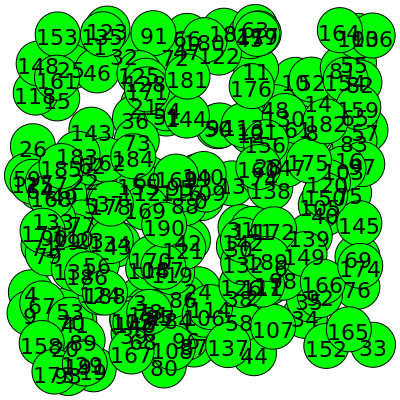
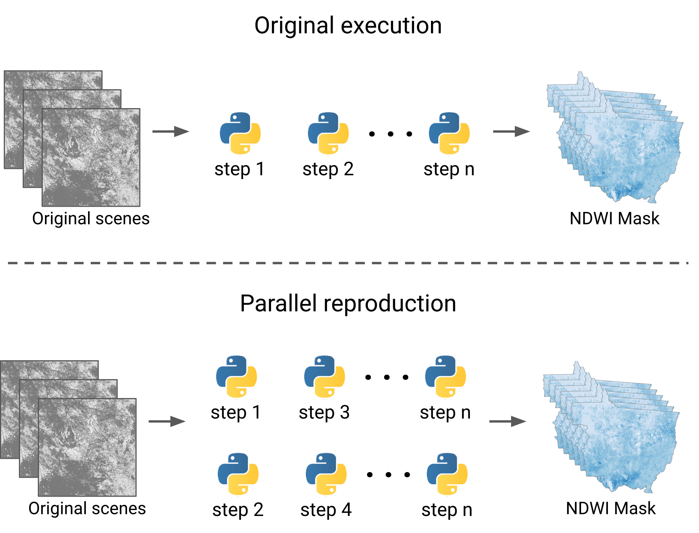

<!-- README.md is generated from README.Rmd. Please edit that file -->

```{r, include = FALSE}
knitr::opts_chunk$set(
    collapse = TRUE,
    comment = "#>",
    out.width = "100%"
)
library(tibble)
```

## bdcrrm-api - Parallel reproduction

The processing steps of research can be expensive and time-consuming. During the research production, when all the steps necessary to obtain the results are unknown, there are no ways out for researchers other than to move forward, process the data, and find the answers. After completion, those who wish to reproduce an experiment have a different scenario. All the steps are known, and we hope to obtain the same results after performing them correctly.

One way to speed up the execution of steps is through **parallelization**, so when **two or more steps are not dependent**, they can be processed simultaneously. This processing way can be useful in many different cases, for example, in yearly data processing where there is no dependency between years or even the calculation of variables and attributes that will not be used together. These are just a few examples of use, certainly, other contexts can benefit from this capability.

Considering this possibility, bdcrrm-api offers functionalities that enable the parallel reproduction of experiments. In this example, we will present the way to use this functionality. For this, it will be used as a base an application where the **N**ormalized **D**ifference **W**ater **I**ndex (NDWI) of scenes extracted from the CBERS-4/AWFI data cube is calculated.

> The data cube used in this example is produced and distributed by the Brazil Data Cube (BDC) project. For more information, please see the [STAC Catalog from BDC project](https://brazildatacube.dpi.inpe.br/stac/).

### Code and Data

For this example, as mentioned earlier, the generation of an NDWI time series will be performed. This application will be performed using the Python library `rr-water-mask`, created especially for this example. This library provides capabilities for producing water masks from scenes extracted from data cubes via the **S**patio **T**emporal **A**sset **C**atalog (STAC) service. In addition, it enables parallel processing of NDWI via [Joblib](https://joblib.readthedocs.io/).

For the data, scenes extracted from the CBERS-4/AWFI data cube, for the state of Mato Grosso/Brazil (bdc-tiles `019023`, `020023`, `021023`, `019024`, `020024`, `021024`, `020025` and `021025`), for the period `2018-01` to `2019-01` will be used. In total, 192 scenes are used in this processing.

> We will retrieve the CBERS-4/AWFI data used in this example from the BDC project's STAC service. This service requires an access key to use the data. If you do not have an access key, create one via BDC Explorer.

### Configuring

To follow the steps presented in this example, you must have a Python environment with the `rr-water-mask` package installed. 

For this requirement, there is a `Dockerfile` available in this example with the instructions to create a complete Jupyter environment to run this example. So, to make use of it, build the image. You can do this build with the `build.sh` script:

```{sh, eval=FALSE}
./build.sh
```

After the build, the Docker Image `bdcrrm/parallel-reproduction:latest` will be available. Use it to start the environment. To do this, you can use the command below:

```{sh, eval=FALSE}
docker run --detach \
           --publish 127.0.0.1:8888:8888 \
           --name parallel-reproduction-example \
           --volume /var/run/docker.sock:/var/run/docker.sock:ro \
           bdcrrm/parallel-reproduction:latest
```

After starting the environment, to access it, you will need to retrieve the Jupyter access key. You can be done this with the command below:

```{sh, eval=FALSE}
docker exec -it parallel-reproduction-example jupyter notebook list

#> http://0.0.0.0:8888/?token=322cdf969c908fa9fe4b2ff6e17c06eb463512fa06ed7c9c :: /home/jovyan
```

The command, as shown, will return an address. Access it in your browser. For example, in the case of the return shown above, it can be accessed in Firefox as follows:

```{sh, eval=FALSE}
firefox http://0.0.0.0:8888/?token=322cdf969c908fa9fe4b2ff6e17c06eb463512fa06ed7c9c
```

### Running

Before you start running, remember to set the environment variable `BDC_ACCES_KEY` to the value of your service access key, for example:

```{sh, eval=FALSE}
export BDC_ACCESS_KEY=MY_KEY_VALUE
```

> Since `bdcrrm-api` saves all the operating system information being used, environment variables are also saved. To prevent environment variables with sensitive information such as the `BDC_ACCESS_KEY` variable from being shared improperly, `bdcrrm-api` introduced the concept of `secrets`. These filters remove all environment variables with the defined nomenclature, allowing the use of databases and web services (e.g., STAC, WTSS, and AWS) that depend on a token or user/password as environment variables without exposing credentials.

**Adding secrets**

```{sh, eval=FALSE}
bdcrrm project settings secrets add BDC_ACCESS_KEY
```

After the secret definition, the scripts can be run through `bdcrrm-api`.

**Running the pipeline**

For this example, the execution of the processing workflow will be done through the `pipeline.sh` script. In this script,  the approach of individual script execution is used. This way, for each processed scene, a script is executed. This execution strategy makes the bdcrrm-api register each scene individually, making it easier to control and manage in case of failure.

Thus, `192` runs are expected to be registered at the end of the processing flow because, as mentioned, the study region in the given period has `192` scenes available.

**1. Configuring the environment variable**

To run the script, first access it and modify the environment variable `BDC_ACCESS_KEY`, which will be used to access the BDC STAC service.

```{sh, eval=FALSE}
cat pipeline.sh

#> #!/bin/bash

#> #
#> # General definitions
#> #
#> export BDC_ACCESS_KEY=""
```

After the modification:

```{sh, eval=FALSE}
cat pipeline.sh

#> #!/bin/bash

#> #
#> # General definitions
#> #
#> export BDC_ACCESS_KEY="YOUR_BDC_ACCESS_KEY_HERE"
```

**2. Run the water mask generation workflow**

> **Note**: This process can be time consuming! We run with a machine with 24 GB RAM and 8 cores, and the water mask took about 6 hours to finish!

```{sh, eval=FALSE}
./pipeline.sh
```

After the water mask processing, bdcrrm-api will have saved all the information needed for reproduction. To verify the registered steps, let's start looking at the execution graph generated:

```{sh, eval=FALSE}
bdcrrm-cli project info --graph

#> bdcrrm-cli: Project details
#> Name:
#>          rr-temporal-watermask
#> Description:
#>          Reproducible Temporal Watermask for Mato Grosso State
#> Author:
#>          Felipe Menino (felipe.carlos@inpe.br)
#> Created at:
#>          2021-09-01 04:08:04
#> Execution Graph: 
```

<details>
<summary>Click here to visualize the execution graph</summary>

```
* 0 (python3 analysis/main.py temporal_water_mask 0)
* 1 (python3 analysis/main.py temporal_water_mask 1)
* 2 (python3 analysis/main.py temporal_water_mask 2)
* 3 (python3 analysis/main.py temporal_water_mask 3)
* 4 (python3 analysis/main.py temporal_water_mask 4)
* 5 (python3 analysis/main.py temporal_water_mask 5)
* 6 (python3 analysis/main.py temporal_water_mask 6)
* 7 (python3 analysis/main.py temporal_water_mask 7)
* 8 (python3 analysis/main.py temporal_water_mask 8)
* 9 (python3 analysis/main.py temporal_water_mask 9)
* 10 (python3 analysis/main.py temporal_water_mask 10)
* 11 (python3 analysis/main.py temporal_water_mask 11)
* 12 (python3 analysis/main.py temporal_water_mask 12)
* 13 (python3 analysis/main.py temporal_water_mask 13)
* 14 (python3 analysis/main.py temporal_water_mask 14)
* 15 (python3 analysis/main.py temporal_water_mask 15)
* 16 (python3 analysis/main.py temporal_water_mask 16)
* 17 (python3 analysis/main.py temporal_water_mask 17)
* 18 (python3 analysis/main.py temporal_water_mask 18)
* 19 (python3 analysis/main.py temporal_water_mask 19)
* 20 (python3 analysis/main.py temporal_water_mask 20)
* 21 (python3 analysis/main.py temporal_water_mask 21)
* 22 (python3 analysis/main.py temporal_water_mask 22)
* 23 (python3 analysis/main.py temporal_water_mask 23)
* 24 (python3 analysis/main.py temporal_water_mask 24)
* 25 (python3 analysis/main.py temporal_water_mask 25)
* 26 (python3 analysis/main.py temporal_water_mask 26)
* 27 (python3 analysis/main.py temporal_water_mask 27)
* 28 (python3 analysis/main.py temporal_water_mask 28)
* 29 (python3 analysis/main.py temporal_water_mask 29)
* 30 (python3 analysis/main.py temporal_water_mask 30)
* 31 (python3 analysis/main.py temporal_water_mask 31)
* 32 (python3 analysis/main.py temporal_water_mask 32)
* 33 (python3 analysis/main.py temporal_water_mask 33)
* 34 (python3 analysis/main.py temporal_water_mask 34)
* 35 (python3 analysis/main.py temporal_water_mask 35)
* 36 (python3 analysis/main.py temporal_water_mask 36)
* 37 (python3 analysis/main.py temporal_water_mask 37)
* 38 (python3 analysis/main.py temporal_water_mask 38)
* 39 (python3 analysis/main.py temporal_water_mask 39)
* 40 (python3 analysis/main.py temporal_water_mask 40)
* 41 (python3 analysis/main.py temporal_water_mask 41)
* 42 (python3 analysis/main.py temporal_water_mask 42)
* 43 (python3 analysis/main.py temporal_water_mask 43)
* 44 (python3 analysis/main.py temporal_water_mask 44)
* 45 (python3 analysis/main.py temporal_water_mask 45)
* 46 (python3 analysis/main.py temporal_water_mask 46)
* 47 (python3 analysis/main.py temporal_water_mask 47)
* 48 (python3 analysis/main.py temporal_water_mask 48)
* 49 (python3 analysis/main.py temporal_water_mask 49)
* 50 (python3 analysis/main.py temporal_water_mask 50)
* 51 (python3 analysis/main.py temporal_water_mask 51)
* 52 (python3 analysis/main.py temporal_water_mask 52)
* 53 (python3 analysis/main.py temporal_water_mask 53)
* 54 (python3 analysis/main.py temporal_water_mask 54)
* 55 (python3 analysis/main.py temporal_water_mask 55)
* 56 (python3 analysis/main.py temporal_water_mask 56)
* 57 (python3 analysis/main.py temporal_water_mask 57)
* 58 (python3 analysis/main.py temporal_water_mask 58)
* 59 (python3 analysis/main.py temporal_water_mask 59)
* 60 (python3 analysis/main.py temporal_water_mask 60)
* 61 (python3 analysis/main.py temporal_water_mask 61)
* 62 (python3 analysis/main.py temporal_water_mask 62)
* 63 (python3 analysis/main.py temporal_water_mask 63)
* 64 (python3 analysis/main.py temporal_water_mask 64)
* 65 (python3 analysis/main.py temporal_water_mask 65)
* 66 (python3 analysis/main.py temporal_water_mask 66)
* 67 (python3 analysis/main.py temporal_water_mask 67)
* 68 (python3 analysis/main.py temporal_water_mask 68)
* 69 (python3 analysis/main.py temporal_water_mask 69)
* 70 (python3 analysis/main.py temporal_water_mask 70)
* 71 (python3 analysis/main.py temporal_water_mask 71)
* 72 (python3 analysis/main.py temporal_water_mask 72)
* 73 (python3 analysis/main.py temporal_water_mask 73)
* 74 (python3 analysis/main.py temporal_water_mask 74)
* 75 (python3 analysis/main.py temporal_water_mask 75)
* 76 (python3 analysis/main.py temporal_water_mask 76)
* 77 (python3 analysis/main.py temporal_water_mask 77)
* 78 (python3 analysis/main.py temporal_water_mask 78)
* 79 (python3 analysis/main.py temporal_water_mask 79)
* 80 (python3 analysis/main.py temporal_water_mask 80)
* 81 (python3 analysis/main.py temporal_water_mask 81)
* 82 (python3 analysis/main.py temporal_water_mask 82)
* 83 (python3 analysis/main.py temporal_water_mask 83)
* 84 (python3 analysis/main.py temporal_water_mask 84)
* 85 (python3 analysis/main.py temporal_water_mask 85)
* 86 (python3 analysis/main.py temporal_water_mask 86)
* 87 (python3 analysis/main.py temporal_water_mask 87)
* 88 (python3 analysis/main.py temporal_water_mask 88)
* 89 (python3 analysis/main.py temporal_water_mask 89)
* 90 (python3 analysis/main.py temporal_water_mask 90)
* 91 (python3 analysis/main.py temporal_water_mask 91)
* 92 (python3 analysis/main.py temporal_water_mask 92)
* 93 (python3 analysis/main.py temporal_water_mask 93)
* 94 (python3 analysis/main.py temporal_water_mask 94)
* 95 (python3 analysis/main.py temporal_water_mask 95)
* 96 (python3 analysis/main.py temporal_water_mask 96)
* 97 (python3 analysis/main.py temporal_water_mask 97)
* 98 (python3 analysis/main.py temporal_water_mask 98)
* 99 (python3 analysis/main.py temporal_water_mask 99)
* 100 (python3 analysis/main.py temporal_water_mask 100)
* 101 (python3 analysis/main.py temporal_water_mask 101)
* 102 (python3 analysis/main.py temporal_water_mask 102)
* 103 (python3 analysis/main.py temporal_water_mask 103)
* 104 (python3 analysis/main.py temporal_water_mask 104)
* 105 (python3 analysis/main.py temporal_water_mask 105)
* 106 (python3 analysis/main.py temporal_water_mask 106)
* 107 (python3 analysis/main.py temporal_water_mask 107)
* 108 (python3 analysis/main.py temporal_water_mask 108)
* 109 (python3 analysis/main.py temporal_water_mask 109)
* 110 (python3 analysis/main.py temporal_water_mask 110)
* 111 (python3 analysis/main.py temporal_water_mask 111)
* 112 (python3 analysis/main.py temporal_water_mask 112)
* 113 (python3 analysis/main.py temporal_water_mask 113)
* 114 (python3 analysis/main.py temporal_water_mask 114)
* 115 (python3 analysis/main.py temporal_water_mask 115)
* 116 (python3 analysis/main.py temporal_water_mask 116)
* 117 (python3 analysis/main.py temporal_water_mask 117)
* 118 (python3 analysis/main.py temporal_water_mask 118)
* 119 (python3 analysis/main.py temporal_water_mask 119)
* 120 (python3 analysis/main.py temporal_water_mask 120)
* 121 (python3 analysis/main.py temporal_water_mask 121)
* 122 (python3 analysis/main.py temporal_water_mask 122)
* 123 (python3 analysis/main.py temporal_water_mask 123)
* 124 (python3 analysis/main.py temporal_water_mask 124)
* 125 (python3 analysis/main.py temporal_water_mask 125)
* 126 (python3 analysis/main.py temporal_water_mask 126)
* 127 (python3 analysis/main.py temporal_water_mask 127)
* 128 (python3 analysis/main.py temporal_water_mask 128)
* 129 (python3 analysis/main.py temporal_water_mask 129)
* 130 (python3 analysis/main.py temporal_water_mask 130)
* 131 (python3 analysis/main.py temporal_water_mask 131)
* 132 (python3 analysis/main.py temporal_water_mask 132)
* 133 (python3 analysis/main.py temporal_water_mask 133)
* 134 (python3 analysis/main.py temporal_water_mask 134)
* 135 (python3 analysis/main.py temporal_water_mask 135)
* 136 (python3 analysis/main.py temporal_water_mask 136)
* 137 (python3 analysis/main.py temporal_water_mask 137)
* 138 (python3 analysis/main.py temporal_water_mask 138)
* 139 (python3 analysis/main.py temporal_water_mask 139)
* 140 (python3 analysis/main.py temporal_water_mask 140)
* 141 (python3 analysis/main.py temporal_water_mask 141)
* 142 (python3 analysis/main.py temporal_water_mask 142)
* 143 (python3 analysis/main.py temporal_water_mask 143)
* 144 (python3 analysis/main.py temporal_water_mask 144)
* 145 (python3 analysis/main.py temporal_water_mask 145)
* 146 (python3 analysis/main.py temporal_water_mask 146)
* 147 (python3 analysis/main.py temporal_water_mask 147)
* 148 (python3 analysis/main.py temporal_water_mask 148)
* 149 (python3 analysis/main.py temporal_water_mask 149)
* 150 (python3 analysis/main.py temporal_water_mask 150)
* 151 (python3 analysis/main.py temporal_water_mask 151)
* 152 (python3 analysis/main.py temporal_water_mask 152)
* 153 (python3 analysis/main.py temporal_water_mask 153)
* 154 (python3 analysis/main.py temporal_water_mask 154)
* 155 (python3 analysis/main.py temporal_water_mask 155)
* 156 (python3 analysis/main.py temporal_water_mask 156)
* 157 (python3 analysis/main.py temporal_water_mask 157)
* 158 (python3 analysis/main.py temporal_water_mask 158)
* 159 (python3 analysis/main.py temporal_water_mask 159)
* 160 (python3 analysis/main.py temporal_water_mask 160)
* 161 (python3 analysis/main.py temporal_water_mask 161)
* 162 (python3 analysis/main.py temporal_water_mask 162)
* 163 (python3 analysis/main.py temporal_water_mask 163)
* 164 (python3 analysis/main.py temporal_water_mask 164)
* 165 (python3 analysis/main.py temporal_water_mask 165)
* 166 (python3 analysis/main.py temporal_water_mask 166)
* 167 (python3 analysis/main.py temporal_water_mask 167)
* 168 (python3 analysis/main.py temporal_water_mask 168)
* 169 (python3 analysis/main.py temporal_water_mask 169)
* 170 (python3 analysis/main.py temporal_water_mask 170)
* 171 (python3 analysis/main.py temporal_water_mask 171)
* 172 (python3 analysis/main.py temporal_water_mask 172)
* 173 (python3 analysis/main.py temporal_water_mask 173)
* 174 (python3 analysis/main.py temporal_water_mask 174)
* 175 (python3 analysis/main.py temporal_water_mask 175)
* 176 (python3 analysis/main.py temporal_water_mask 176)
* 177 (python3 analysis/main.py temporal_water_mask 177)
* 178 (python3 analysis/main.py temporal_water_mask 178)
* 179 (python3 analysis/main.py temporal_water_mask 179)
* 180 (python3 analysis/main.py temporal_water_mask 180)
* 181 (python3 analysis/main.py temporal_water_mask 181)
* 182 (python3 analysis/main.py temporal_water_mask 182)
* 183 (python3 analysis/main.py temporal_water_mask 183)
* 184 (python3 analysis/main.py temporal_water_mask 184)
* 185 (python3 analysis/main.py temporal_water_mask 185)
* 186 (python3 analysis/main.py temporal_water_mask 186)
* 187 (python3 analysis/main.py temporal_water_mask 187)
* 188 (python3 analysis/main.py temporal_water_mask 188)
* 189 (python3 analysis/main.py temporal_water_mask 189)
* 190 (python3 analysis/main.py temporal_water_mask 190)
* 191 (python3 analysis/main.py temporal_water_mask 191)
```
</details>

<br>

We can also see the graph as a table, which summarizes the node commands and their status.

```{sh, eval=FALSE}
bdcrrm-cli project graph show --as-table-status

#> bdcrrm-cli: Graph visualization
```

<details>
<summary>Click here to visualize the execution graph as a table</summary>

```
                         Execution vertices status                         
┏━━━━━━━━━━━┳━━━━━━━━━━━━━━━━━━━━━━━━━━━━━━━━━━━━━━━━━━━━━━━━━━┳━━━━━━━━━━┓
┃ Vertex ID ┃                     Command                      ┃  Status  ┃
┡━━━━━━━━━━━╇━━━━━━━━━━━━━━━━━━━━━━━━━━━━━━━━━━━━━━━━━━━━━━━━━━╇━━━━━━━━━━┩
│     0     │  python3 analysis/main.py temporal_water_mask 0  │ updated✔ │
│     1     │  python3 analysis/main.py temporal_water_mask 1  │ updated✔ │
│     2     │  python3 analysis/main.py temporal_water_mask 2  │ updated✔ │
│     3     │  python3 analysis/main.py temporal_water_mask 3  │ updated✔ │
│     4     │  python3 analysis/main.py temporal_water_mask 4  │ updated✔ │
│     5     │  python3 analysis/main.py temporal_water_mask 5  │ updated✔ │
│     6     │  python3 analysis/main.py temporal_water_mask 6  │ updated✔ │
│     7     │  python3 analysis/main.py temporal_water_mask 7  │ updated✔ │
│     8     │  python3 analysis/main.py temporal_water_mask 8  │ updated✔ │
│     9     │  python3 analysis/main.py temporal_water_mask 9  │ updated✔ │
│    10     │ python3 analysis/main.py temporal_water_mask 10  │ updated✔ │
│    11     │ python3 analysis/main.py temporal_water_mask 11  │ updated✔ │
│    12     │ python3 analysis/main.py temporal_water_mask 12  │ updated✔ │
│    13     │ python3 analysis/main.py temporal_water_mask 13  │ updated✔ │
│    14     │ python3 analysis/main.py temporal_water_mask 14  │ updated✔ │
│    15     │ python3 analysis/main.py temporal_water_mask 15  │ updated✔ │
│    16     │ python3 analysis/main.py temporal_water_mask 16  │ updated✔ │
│    17     │ python3 analysis/main.py temporal_water_mask 17  │ updated✔ │
│    18     │ python3 analysis/main.py temporal_water_mask 18  │ updated✔ │
│    19     │ python3 analysis/main.py temporal_water_mask 19  │ updated✔ │
│    20     │ python3 analysis/main.py temporal_water_mask 20  │ updated✔ │
│    21     │ python3 analysis/main.py temporal_water_mask 21  │ updated✔ │
│    22     │ python3 analysis/main.py temporal_water_mask 22  │ updated✔ │
│    23     │ python3 analysis/main.py temporal_water_mask 23  │ updated✔ │
│    24     │ python3 analysis/main.py temporal_water_mask 24  │ updated✔ │
│    25     │ python3 analysis/main.py temporal_water_mask 25  │ updated✔ │
│    26     │ python3 analysis/main.py temporal_water_mask 26  │ updated✔ │
│    27     │ python3 analysis/main.py temporal_water_mask 27  │ updated✔ │
│    28     │ python3 analysis/main.py temporal_water_mask 28  │ updated✔ │
│    29     │ python3 analysis/main.py temporal_water_mask 29  │ updated✔ │
│    30     │ python3 analysis/main.py temporal_water_mask 30  │ updated✔ │
│    31     │ python3 analysis/main.py temporal_water_mask 31  │ updated✔ │
│    32     │ python3 analysis/main.py temporal_water_mask 32  │ updated✔ │
│    33     │ python3 analysis/main.py temporal_water_mask 33  │ updated✔ │
│    34     │ python3 analysis/main.py temporal_water_mask 34  │ updated✔ │
│    35     │ python3 analysis/main.py temporal_water_mask 35  │ updated✔ │
│    36     │ python3 analysis/main.py temporal_water_mask 36  │ updated✔ │
│    37     │ python3 analysis/main.py temporal_water_mask 37  │ updated✔ │
│    38     │ python3 analysis/main.py temporal_water_mask 38  │ updated✔ │
│    39     │ python3 analysis/main.py temporal_water_mask 39  │ updated✔ │
│    40     │ python3 analysis/main.py temporal_water_mask 40  │ updated✔ │
│    41     │ python3 analysis/main.py temporal_water_mask 41  │ updated✔ │
│    42     │ python3 analysis/main.py temporal_water_mask 42  │ updated✔ │
│    43     │ python3 analysis/main.py temporal_water_mask 43  │ updated✔ │
│    44     │ python3 analysis/main.py temporal_water_mask 44  │ updated✔ │
│    45     │ python3 analysis/main.py temporal_water_mask 45  │ updated✔ │
│    46     │ python3 analysis/main.py temporal_water_mask 46  │ updated✔ │
│    47     │ python3 analysis/main.py temporal_water_mask 47  │ updated✔ │
│    48     │ python3 analysis/main.py temporal_water_mask 48  │ updated✔ │
│    49     │ python3 analysis/main.py temporal_water_mask 49  │ updated✔ │
│    50     │ python3 analysis/main.py temporal_water_mask 50  │ updated✔ │
│    51     │ python3 analysis/main.py temporal_water_mask 51  │ updated✔ │
│    52     │ python3 analysis/main.py temporal_water_mask 52  │ updated✔ │
│    53     │ python3 analysis/main.py temporal_water_mask 53  │ updated✔ │
│    54     │ python3 analysis/main.py temporal_water_mask 54  │ updated✔ │
│    55     │ python3 analysis/main.py temporal_water_mask 55  │ updated✔ │
│    56     │ python3 analysis/main.py temporal_water_mask 56  │ updated✔ │
│    57     │ python3 analysis/main.py temporal_water_mask 57  │ updated✔ │
│    58     │ python3 analysis/main.py temporal_water_mask 58  │ updated✔ │
│    59     │ python3 analysis/main.py temporal_water_mask 59  │ updated✔ │
│    60     │ python3 analysis/main.py temporal_water_mask 60  │ updated✔ │
│    61     │ python3 analysis/main.py temporal_water_mask 61  │ updated✔ │
│    62     │ python3 analysis/main.py temporal_water_mask 62  │ updated✔ │
│    63     │ python3 analysis/main.py temporal_water_mask 63  │ updated✔ │
│    64     │ python3 analysis/main.py temporal_water_mask 64  │ updated✔ │
│    65     │ python3 analysis/main.py temporal_water_mask 65  │ updated✔ │
│    66     │ python3 analysis/main.py temporal_water_mask 66  │ updated✔ │
│    67     │ python3 analysis/main.py temporal_water_mask 67  │ updated✔ │
│    68     │ python3 analysis/main.py temporal_water_mask 68  │ updated✔ │
│    69     │ python3 analysis/main.py temporal_water_mask 69  │ updated✔ │
│    70     │ python3 analysis/main.py temporal_water_mask 70  │ updated✔ │
│    71     │ python3 analysis/main.py temporal_water_mask 71  │ updated✔ │
│    72     │ python3 analysis/main.py temporal_water_mask 72  │ updated✔ │
│    73     │ python3 analysis/main.py temporal_water_mask 73  │ updated✔ │
│    74     │ python3 analysis/main.py temporal_water_mask 74  │ updated✔ │
│    75     │ python3 analysis/main.py temporal_water_mask 75  │ updated✔ │
│    76     │ python3 analysis/main.py temporal_water_mask 76  │ updated✔ │
│    77     │ python3 analysis/main.py temporal_water_mask 77  │ updated✔ │
│    78     │ python3 analysis/main.py temporal_water_mask 78  │ updated✔ │
│    79     │ python3 analysis/main.py temporal_water_mask 79  │ updated✔ │
│    80     │ python3 analysis/main.py temporal_water_mask 80  │ updated✔ │
│    81     │ python3 analysis/main.py temporal_water_mask 81  │ updated✔ │
│    82     │ python3 analysis/main.py temporal_water_mask 82  │ updated✔ │
│    83     │ python3 analysis/main.py temporal_water_mask 83  │ updated✔ │
│    84     │ python3 analysis/main.py temporal_water_mask 84  │ updated✔ │
│    85     │ python3 analysis/main.py temporal_water_mask 85  │ updated✔ │
│    86     │ python3 analysis/main.py temporal_water_mask 86  │ updated✔ │
│    87     │ python3 analysis/main.py temporal_water_mask 87  │ updated✔ │
│    88     │ python3 analysis/main.py temporal_water_mask 88  │ updated✔ │
│    89     │ python3 analysis/main.py temporal_water_mask 89  │ updated✔ │
│    90     │ python3 analysis/main.py temporal_water_mask 90  │ updated✔ │
│    91     │ python3 analysis/main.py temporal_water_mask 91  │ updated✔ │
│    92     │ python3 analysis/main.py temporal_water_mask 92  │ updated✔ │
│    93     │ python3 analysis/main.py temporal_water_mask 93  │ updated✔ │
│    94     │ python3 analysis/main.py temporal_water_mask 94  │ updated✔ │
│    95     │ python3 analysis/main.py temporal_water_mask 95  │ updated✔ │
│    96     │ python3 analysis/main.py temporal_water_mask 96  │ updated✔ │
│    97     │ python3 analysis/main.py temporal_water_mask 97  │ updated✔ │
│    98     │ python3 analysis/main.py temporal_water_mask 98  │ updated✔ │
│    99     │ python3 analysis/main.py temporal_water_mask 99  │ updated✔ │
│    100    │ python3 analysis/main.py temporal_water_mask 100 │ updated✔ │
│    101    │ python3 analysis/main.py temporal_water_mask 101 │ updated✔ │
│    102    │ python3 analysis/main.py temporal_water_mask 102 │ updated✔ │
│    103    │ python3 analysis/main.py temporal_water_mask 103 │ updated✔ │
│    104    │ python3 analysis/main.py temporal_water_mask 104 │ updated✔ │
│    105    │ python3 analysis/main.py temporal_water_mask 105 │ updated✔ │
│    106    │ python3 analysis/main.py temporal_water_mask 106 │ updated✔ │
│    107    │ python3 analysis/main.py temporal_water_mask 107 │ updated✔ │
│    108    │ python3 analysis/main.py temporal_water_mask 108 │ updated✔ │
│    109    │ python3 analysis/main.py temporal_water_mask 109 │ updated✔ │
│    110    │ python3 analysis/main.py temporal_water_mask 110 │ updated✔ │
│    111    │ python3 analysis/main.py temporal_water_mask 111 │ updated✔ │
│    112    │ python3 analysis/main.py temporal_water_mask 112 │ updated✔ │
│    113    │ python3 analysis/main.py temporal_water_mask 113 │ updated✔ │
│    114    │ python3 analysis/main.py temporal_water_mask 114 │ updated✔ │
│    115    │ python3 analysis/main.py temporal_water_mask 115 │ updated✔ │
│    116    │ python3 analysis/main.py temporal_water_mask 116 │ updated✔ │
│    117    │ python3 analysis/main.py temporal_water_mask 117 │ updated✔ │
│    118    │ python3 analysis/main.py temporal_water_mask 118 │ updated✔ │
│    119    │ python3 analysis/main.py temporal_water_mask 119 │ updated✔ │
│    120    │ python3 analysis/main.py temporal_water_mask 120 │ updated✔ │
│    121    │ python3 analysis/main.py temporal_water_mask 121 │ updated✔ │
│    122    │ python3 analysis/main.py temporal_water_mask 122 │ updated✔ │
│    123    │ python3 analysis/main.py temporal_water_mask 123 │ updated✔ │
│    124    │ python3 analysis/main.py temporal_water_mask 124 │ updated✔ │
│    125    │ python3 analysis/main.py temporal_water_mask 125 │ updated✔ │
│    126    │ python3 analysis/main.py temporal_water_mask 126 │ updated✔ │
│    127    │ python3 analysis/main.py temporal_water_mask 127 │ updated✔ │
│    128    │ python3 analysis/main.py temporal_water_mask 128 │ updated✔ │
│    129    │ python3 analysis/main.py temporal_water_mask 129 │ updated✔ │
│    130    │ python3 analysis/main.py temporal_water_mask 130 │ updated✔ │
│    131    │ python3 analysis/main.py temporal_water_mask 131 │ updated✔ │
│    132    │ python3 analysis/main.py temporal_water_mask 132 │ updated✔ │
│    133    │ python3 analysis/main.py temporal_water_mask 133 │ updated✔ │
│    134    │ python3 analysis/main.py temporal_water_mask 134 │ updated✔ │
│    135    │ python3 analysis/main.py temporal_water_mask 135 │ updated✔ │
│    136    │ python3 analysis/main.py temporal_water_mask 136 │ updated✔ │
│    137    │ python3 analysis/main.py temporal_water_mask 137 │ updated✔ │
│    138    │ python3 analysis/main.py temporal_water_mask 138 │ updated✔ │
│    139    │ python3 analysis/main.py temporal_water_mask 139 │ updated✔ │
│    140    │ python3 analysis/main.py temporal_water_mask 140 │ updated✔ │
│    141    │ python3 analysis/main.py temporal_water_mask 141 │ updated✔ │
│    142    │ python3 analysis/main.py temporal_water_mask 142 │ updated✔ │
│    143    │ python3 analysis/main.py temporal_water_mask 143 │ updated✔ │
│    144    │ python3 analysis/main.py temporal_water_mask 144 │ updated✔ │
│    145    │ python3 analysis/main.py temporal_water_mask 145 │ updated✔ │
│    146    │ python3 analysis/main.py temporal_water_mask 146 │ updated✔ │
│    147    │ python3 analysis/main.py temporal_water_mask 147 │ updated✔ │
│    148    │ python3 analysis/main.py temporal_water_mask 148 │ updated✔ │
│    149    │ python3 analysis/main.py temporal_water_mask 149 │ updated✔ │
│    150    │ python3 analysis/main.py temporal_water_mask 150 │ updated✔ │
│    151    │ python3 analysis/main.py temporal_water_mask 151 │ updated✔ │
│    152    │ python3 analysis/main.py temporal_water_mask 152 │ updated✔ │
│    153    │ python3 analysis/main.py temporal_water_mask 153 │ updated✔ │
│    154    │ python3 analysis/main.py temporal_water_mask 154 │ updated✔ │
│    155    │ python3 analysis/main.py temporal_water_mask 155 │ updated✔ │
│    156    │ python3 analysis/main.py temporal_water_mask 156 │ updated✔ │
│    157    │ python3 analysis/main.py temporal_water_mask 157 │ updated✔ │
│    158    │ python3 analysis/main.py temporal_water_mask 158 │ updated✔ │
│    159    │ python3 analysis/main.py temporal_water_mask 159 │ updated✔ │
│    160    │ python3 analysis/main.py temporal_water_mask 160 │ updated✔ │
│    161    │ python3 analysis/main.py temporal_water_mask 161 │ updated✔ │
│    162    │ python3 analysis/main.py temporal_water_mask 162 │ updated✔ │
│    163    │ python3 analysis/main.py temporal_water_mask 163 │ updated✔ │
│    164    │ python3 analysis/main.py temporal_water_mask 164 │ updated✔ │
│    165    │ python3 analysis/main.py temporal_water_mask 165 │ updated✔ │
│    166    │ python3 analysis/main.py temporal_water_mask 166 │ updated✔ │
│    167    │ python3 analysis/main.py temporal_water_mask 167 │ updated✔ │
│    168    │ python3 analysis/main.py temporal_water_mask 168 │ updated✔ │
│    169    │ python3 analysis/main.py temporal_water_mask 169 │ updated✔ │
│    170    │ python3 analysis/main.py temporal_water_mask 170 │ updated✔ │
│    171    │ python3 analysis/main.py temporal_water_mask 171 │ updated✔ │
│    172    │ python3 analysis/main.py temporal_water_mask 172 │ updated✔ │
│    173    │ python3 analysis/main.py temporal_water_mask 173 │ updated✔ │
│    174    │ python3 analysis/main.py temporal_water_mask 174 │ updated✔ │
│    175    │ python3 analysis/main.py temporal_water_mask 175 │ updated✔ │
│    176    │ python3 analysis/main.py temporal_water_mask 176 │ updated✔ │
│    177    │ python3 analysis/main.py temporal_water_mask 177 │ updated✔ │
│    178    │ python3 analysis/main.py temporal_water_mask 178 │ updated✔ │
│    179    │ python3 analysis/main.py temporal_water_mask 179 │ updated✔ │
│    180    │ python3 analysis/main.py temporal_water_mask 180 │ updated✔ │
│    181    │ python3 analysis/main.py temporal_water_mask 181 │ updated✔ │
│    182    │ python3 analysis/main.py temporal_water_mask 182 │ updated✔ │
│    183    │ python3 analysis/main.py temporal_water_mask 183 │ updated✔ │
│    184    │ python3 analysis/main.py temporal_water_mask 184 │ updated✔ │
│    185    │ python3 analysis/main.py temporal_water_mask 185 │ updated✔ │
│    186    │ python3 analysis/main.py temporal_water_mask 186 │ updated✔ │
│    187    │ python3 analysis/main.py temporal_water_mask 187 │ updated✔ │
│    188    │ python3 analysis/main.py temporal_water_mask 188 │ updated✔ │
│    189    │ python3 analysis/main.py temporal_water_mask 189 │ updated✔ │
│    190    │ python3 analysis/main.py temporal_water_mask 190 │ updated✔ │
│    191    │ python3 analysis/main.py temporal_water_mask 191 │ updated✔ │
└───────────┴──────────────────────────────────────────────────┴──────────┘
```

</details>

<br>

Alternatively, we can view the graph as a figure

```{sh, eval=FALSE}
bdcrrm-cli project graph plot -f parallel-execution.png

#> bdcrrm-cli: Graph visualization
#> bdcrrm-cli: Creating the plot...
#> bdcrrm-cli: Plot created on parallel-execution.png
#> bdcrrm-cli: Finished!
```

<details>
<summary>Click here to visualize the execution graph as a figure</summary>

<div align="center">
```{r graph3, echo=FALSE, out.width="55%", fig.align='center'}

```
</div>

</details>

<br>

We have many nodes! By analyzing each of them, we see that the nodes are independent. Thus, the generation of one node does not depend on another. This property makes this scenario possible for the application of parallel reproduction offered by bdcrrm-api. So let's export the project to test this functionality.

```{sh, eval=FALSE}
bdcrrm-cli project shipment export --output-dir parallel_reproduction

#> bdcrrm-cli: Project Export
#> bdcrrm-cli: Validating the project...
#> bdcrrm-cli: Exporting the project!
#> bdcrrm-cli: Finished!
```

### Parallel reproduction

To perform the parallel reproduction, first we must load the exported project (in `.zip` format) as a new project:

```{sh, eval=FALSE}
bdcrrm-cli project shipment import -f parallel_reproduction/parallel-reproduction.zip -d imported_project
```

The imported project and its contents are available in the directory `imported_project/parallel-reproduction`:

```{sh, eval=FALSE}
cd imported_project/parallel-reproduction
```

In this directory, you can retrieve the project information as well as re-execute the project. For the second case, you will need to configure the `secrets' removed from the package. When you look at the project secrets, you have:

```{sh, eval=FALSE}
bdcrrm-cli project settings secrets list

#> bdcrrm-cli: Secrets settings
#> bdcrrm-cli: Listing secrets
#> Project Secrets              
#> └── BDC_ACCESS_KEY 
```

As expected, the value of the environment variable `BDC_ACCESS_KEY` is not available in the package and needs to be set before reproducing the results. Therefore, it is necessary to create a file and then insert the name of the environment variables and their respective values in each line. In `bdcrrm-api`, this file is already created at import time in the root of the imported project with the name **secrets**. In this file, all the variables needed to re-run the project are listed:

```{sh, eval=FALSE}
cat secrets

#> BDC_ACCESS_KEY
```

In this case, only `BDC_ACCESS_KEY` needs to be set, so go to the **secrets** file and fill in its value with your access key to the BDC services.

```{sh, eval=FALSE}
cat secrets

#> BDC_ACCESS_KEY=YOU_BDC_ACCESS_TOKEN
```

Now the reproduction can be performed. At this stage, we can enable parallel execution. To do this, let's look at the options that the `make` reproduction method provides:

```{sh, eval=FALSE}
bdcrrm-cli reproduction make --help

#> Usage: bdcrrm-cli reproduction make [OPTIONS]
#> 
#>   Reproduce a project.
#> 
#> Options:
#>   -i, --inputs-file TEXT    To reproduce a project, it may be necessary to
#>                             define the input files used in its various stages.
#>                             In `bdcrrm-cli`,all the required inputs are mapped
#>                             into a JSON file through the `bdcrrm-cli project
#>                             inputs template` command. Here the format of the
#>                             JSON document expected by the tool is determined,
#>                             and the name of each file must be defined for
#>                             reproduction. This parameter must specify the full
#>                             path to this JSON file populated.
#>   -s, --secrets-file TEXT   If the project requires the definition of secrets,
#>                             use this parameter to determine the complete path
#>                             to the file that defines the needed secrets'
#>                             values. A template file (secrets) with all
#>                             required secrets is generated when the project is
#>                             imported. Also, if you want to know what secrets
#>                             are used in the project, use the `bdcrrm-cli
#>                             project settings secrets list` command.
#>   -m, --processors INTEGER  The number of processes used for project
#>                             reproduction. When this parameter is greater than
#>                             1, operations are parallelized, and more than one
#>                             step of the execution graph is executed
#>                             simultaneously.
#>   --help                    Show this message and exit.
```

Among the available options is the `-m` (`--processors`) parameter. It enables you to specify the number of processes that should be used on experiment execution. Thus, for values of `-m` greater than 1, the graph will be traversed and executed in topological order, considering `m` nodes simultaneously.

So, in the same way as illustrated in the figure below, while the original execution was done serially, with one processing following another, in the parallel reproduction, more than one node of the graph will be processed simultaneously. It is worth considering that no changes in how the script was created and configured.

```{r parallelexecution, echo=FALSE, out.width="85%", fig.align='center'}

```

<br>

To exemplify the operation, we will run it with 4 processes. Thus, four nodes of the graph will be processed at the same time:

```{sh, eval=FALSE}
bdcrrm-cli reproduction make -s secrets --processors 4

#> bdcrrm-cli: Project reproduction.
#> bdcrrm-cli: Loading required secrets.
#> bdcrrm-cli: Reproducing the project.
```

<details>
<summary>Click here to visualize the reproduction log</summary>
```
Reproducing: python3 analysis/main.py temporal_water_mask 0
Checksum: 1220dd6083ede135c6b0f1c51462a4c65132b0f3658ff5d3818892e3ea967d782644
Reproducing: python3 analysis/main.py temporal_water_mask 1
Checksum: 1220e140f2b28c3231527e38bfe31df2898c912d8bec7c412ccab0d608da71204302
Reproducing: python3 analysis/main.py temporal_water_mask 2
Checksum: 12201b742d964cf51bf9435b795f49c215eecf056e3f35ef663a0423e5d042079b1d
Reproducing: python3 analysis/main.py temporal_water_mask 3
Checksum: 1220c22a1d8b5b10bc7c9de807e666dca30f8b84d942b8c2a03c467a28de9bbc5603
Reproducing: python3 analysis/main.py temporal_water_mask 4
Checksum: 122074aa3edc26a5de4c13864d72a56b8cec6e223855626dd32446c9e8c1b0dc861d
Reproducing: python3 analysis/main.py temporal_water_mask 5
Checksum: 122037f78ab953f9845af2c7bfc03e4b936a833380dfc724e7532aa5bdf18b1118f4
Reproducing: python3 analysis/main.py temporal_water_mask 6
Checksum: 1220a87d603d4eb58dcae095013976f465c2368a2570c954a7973bb90a3e60988a22
Reproducing: python3 analysis/main.py temporal_water_mask 7
Checksum: 122023242ed386db8f606b045049c1faaad4316706cf38bb47f517532b059d6ce9fe
Reproducing: python3 analysis/main.py temporal_water_mask 8
Checksum: 12202c758030277484305182d8714c2e9df2ee010b6996d025662a7475b42925b257
Reproducing: python3 analysis/main.py temporal_water_mask 9
Checksum: 12207da69e4841205f8be7ac3dcddec8632e5f358acbe84ce1051eea4d79e147ddaf
Reproducing: python3 analysis/main.py temporal_water_mask 10
Checksum: 122002d97ee3916b88f2824a2b019850842ea0c6dedd4d56cab3789fa8ddbb0407cc
Reproducing: python3 analysis/main.py temporal_water_mask 11
Checksum: 122081d2797210a62f80972b82b3bf3a509f2a7825bb55e0a3d35d0c170dce421d29
Reproducing: python3 analysis/main.py temporal_water_mask 12
Checksum: 1220e3c16d462b57f26c5479fedb6c6413fc64f1b231a5a1abaaaad1740592f4aa38
Reproducing: python3 analysis/main.py temporal_water_mask 13
Checksum: 122096e7fa6ba928ef98999c57592a40d18979a1bda5cd361dbeefd88659130174f9
Reproducing: python3 analysis/main.py temporal_water_mask 14
Checksum: 1220d7bf8daf8d31d61d229ee161b765a38ec337dd238f8fcf7ad5f7508827331dc5
Reproducing: python3 analysis/main.py temporal_water_mask 15
Checksum: 12209e38966c3318ca05d5419954f7e97d4f6237afe76db139dea47a00ff36a1e898
Reproducing: python3 analysis/main.py temporal_water_mask 16
Checksum: 12200b3d2993b465e394222c44fadf81e350cf93112080ce5459b7a5d8661dc3ac23
Reproducing: python3 analysis/main.py temporal_water_mask 17
Checksum: 12209312d821d9448edc8267df83621d55620cdfa1b34b192afdb60f1a6b330cd41a
Reproducing: python3 analysis/main.py temporal_water_mask 18
Checksum: 1220cbce76284dd9793bc8d4b3fdbe0f775cfea101fdfdf796184b0b77eed09b9122
Reproducing: python3 analysis/main.py temporal_water_mask 19
Checksum: 12201d213cb35d431cc28695683888a63b363f481ce880dc1bbc79cb4c438d59fc8d
Reproducing: python3 analysis/main.py temporal_water_mask 20
Checksum: 122091c02919d8ce845beae1e308590684cd03ad0e0fb3339d161d241dfcdf10cf5f
Reproducing: python3 analysis/main.py temporal_water_mask 21
Checksum: 122050b65ba3b86d9053d55ce1117cc2a462f32dee8f9b91c47ced3c80e68efe3226
Reproducing: python3 analysis/main.py temporal_water_mask 22
Checksum: 1220a7add14f21fcf09e020b0bd49f2ebd64263c3f1905c1d4289c723765c16e8c1c
Reproducing: python3 analysis/main.py temporal_water_mask 23
Checksum: 12207d6528f16a480a5c4ede7f8fee2168eaaab62f9b93f39df2007f05642a55cf6e
Reproducing: python3 analysis/main.py temporal_water_mask 24
Checksum: 12207ac340145625645dbea0c0b0997c25655ed0763029f1481cc5388f1aa222d597
Reproducing: python3 analysis/main.py temporal_water_mask 25
Checksum: 1220cbb608c039c4166a8efc1d744d35da0b1e4c95ab99c4b247f45db897460c2cb1
Reproducing: python3 analysis/main.py temporal_water_mask 26
Checksum: 122015f79438bac35b04accfae2df8e4eb9ffdc3c1b0931009a7f680efd3586744bc
Reproducing: python3 analysis/main.py temporal_water_mask 27
Checksum: 12203d71671a526b02876e609561b28e03c47ee1a979d16481b4f0a70cf74b58231e
Reproducing: python3 analysis/main.py temporal_water_mask 28
Checksum: 12208fefb46ddfdbb411304878a66d7c15b3cc4912424b081f23673ed304ae98bd35
Reproducing: python3 analysis/main.py temporal_water_mask 29
Checksum: 12205ad08a319f2fe1657d59644a4675bdb9e2033b5f4d5974823c9b281debe94542
Reproducing: python3 analysis/main.py temporal_water_mask 30
Checksum: 1220251c01ae15d65c8b41bd286d3baa7b410e7c5f5acbe5bc8edad6320759773775
Reproducing: python3 analysis/main.py temporal_water_mask 31
Checksum: 12208311cefbea739e48e9dae72057cd10ba799254334101e2fb81b4bb4bea3e18fd
Reproducing: python3 analysis/main.py temporal_water_mask 32
Checksum: 1220ef2921ad9565a92329dae91b75f7bcb9343f9274bac4533dac1a97e5ed68e9be
Reproducing: python3 analysis/main.py temporal_water_mask 33
Checksum: 12202c498741161864efb2343706c10c1bc8eff2794d693a4a2b7294ffcd49e219a3
Reproducing: python3 analysis/main.py temporal_water_mask 34
Checksum: 122020e5c27aa0a548d2d43e556fe95a0af399bb57cb201984d194574dc0f4229a90
Reproducing: python3 analysis/main.py temporal_water_mask 35
Checksum: 1220586930b45fb7d102073eab9b25bc21218a3ebee9d71ea5f5c0da88d7f0c45319
Reproducing: python3 analysis/main.py temporal_water_mask 36
Checksum: 1220d938aecc9b8b139c0170df37a69da9b1407caf7cb9ffbb333d1c9d8341a9ba4e
Reproducing: python3 analysis/main.py temporal_water_mask 37
Checksum: 1220573a7e58ffc4ace97e55ab4e3c3d9199dceab947646bbc94ea1e91b8fcc696e8
Reproducing: python3 analysis/main.py temporal_water_mask 38
Checksum: 12204d2a40d59e6d5ff1906e72fc9c2f9d94df2a77c3c0b8417f5764a253ba951692
Reproducing: python3 analysis/main.py temporal_water_mask 39
Checksum: 1220dc22dfcdca083392e5efd29353845d7671d9fbbe53ce1896d2880c6c18fd453f
Reproducing: python3 analysis/main.py temporal_water_mask 40
Checksum: 12203f2a10160020d6bc98346aa409c58d476c8e8a98cd5404cc56281817229d8fd9
Reproducing: python3 analysis/main.py temporal_water_mask 41
Checksum: 122047305dd56dc04978e29ee927a4586b25cadff08f75b7d2fc3bfdfa917609ce32
Reproducing: python3 analysis/main.py temporal_water_mask 42
Checksum: 1220d7961e19d83cfc36f14c1a04063f1695d3bc641fe8873474bef2880ca1faf4b7
Reproducing: python3 analysis/main.py temporal_water_mask 43
Checksum: 122012db759882913c24435dcf395653bf5eb51b2ede9a3ac4fd3db4080e9a46a725
Reproducing: python3 analysis/main.py temporal_water_mask 44
Checksum: 12207f05d125673477edde9909d2a66399f51079499ec3afa6cae5aa43afad419e20
Reproducing: python3 analysis/main.py temporal_water_mask 45
Checksum: 1220e288e3e1a085477e9ad799fb1ea1136d4d376695b817420c2372aa491c7de821
Reproducing: python3 analysis/main.py temporal_water_mask 46
Checksum: 12208a2e9843baa14d238929fec96c2f76a3f9477e0f975dd3b9a71c773cdb601082
Reproducing: python3 analysis/main.py temporal_water_mask 47
Checksum: 1220c5870a4cbc31d29134de08de81481f9d7e91dd03bbc905e9123ccc8a67777c18
Reproducing: python3 analysis/main.py temporal_water_mask 48
Checksum: 12203c3a5440d8068ece28217f9be0bed4bd6d868de65c448a87a25f4778f9c80f5c
Reproducing: python3 analysis/main.py temporal_water_mask 49
Checksum: 1220f2a83c70ffe353539af87bd496b021c7082b437ce9200153bf54ec0f7cfe7951
Reproducing: python3 analysis/main.py temporal_water_mask 50
Checksum: 1220fdba7aa6c0c58726ef4714a9f9197debd09846db2b8ade5efd465c22857823a2
Reproducing: python3 analysis/main.py temporal_water_mask 51
Checksum: 122026aae94f95f2f6029f7b8ddb52d70a95081f43c57ac61aa53070dff7cf60b765
Reproducing: python3 analysis/main.py temporal_water_mask 52
Checksum: 1220da3e43cd32ba5e54bb1d43a06e4a26bfe85440fdd3d76660a6c76443b5800e48
Reproducing: python3 analysis/main.py temporal_water_mask 53
Checksum: 12207ccdb5cc2265f5051570e68bac82449742dc182aa313afe343352d15082ddb94
Reproducing: python3 analysis/main.py temporal_water_mask 54
Checksum: 122020d8f8f5dc82e35c199e5a869eff864b71b9c1eb63c17eea5c5a703fc3a75c10
Reproducing: python3 analysis/main.py temporal_water_mask 55
Checksum: 1220345965837dc9b99980c301d6080c001d6edcbb6f805fdaabc70fee9812871249
Reproducing: python3 analysis/main.py temporal_water_mask 56
Checksum: 1220896b5d8e6a6a4f74bdb4a6f111735ecf33f413984d2d091e0dfd6726a5a1c0b9
Reproducing: python3 analysis/main.py temporal_water_mask 57
Checksum: 1220c428b4828664cce1b3cff033372424e17e66614c1f3f5503f8cdbc3ea18bea08
Reproducing: python3 analysis/main.py temporal_water_mask 58
Checksum: 122065892ecbcb36d47bf41b9deae0484a19a558542ff448647d2508b2fe2b47d03d
Reproducing: python3 analysis/main.py temporal_water_mask 59
Checksum: 12204bf3817990999eb17602c7873d2bacb6a06ddd22e3723940cd00b497ed62a6cf
Reproducing: python3 analysis/main.py temporal_water_mask 60
Checksum: 122029befcf5e60095cd9e5c6028f016395a16ef5ad886d999229f3b396b13e13d45
Reproducing: python3 analysis/main.py temporal_water_mask 61
Checksum: 1220f1304f3d97991fe090609c6383595eb1fe6ee702f7dd2e8cc70e1705b3de655a
Reproducing: python3 analysis/main.py temporal_water_mask 62
Checksum: 122010dba9bced26488a4dd9457fa792ede7e33ce92789d392688e74a1776dc078bd
Reproducing: python3 analysis/main.py temporal_water_mask 63
Checksum: 1220a500e9bbd104617897517c3e639a14c257f34d9ea2b5321e02ee4f7d8c80ce64
Reproducing: python3 analysis/main.py temporal_water_mask 64
Checksum: 12206c651e44dc0b4fa9b4ccfbdc8a84a3e834f1a0c06f245ecf411ea78fb7f98b1b
Reproducing: python3 analysis/main.py temporal_water_mask 65
Checksum: 122014e162e68f7f9f2694631305c74ebdc4e1980e7e2275bb3a297f5b3efc8bdf34
Reproducing: python3 analysis/main.py temporal_water_mask 66
Checksum: 1220a2ed43b4e47358d1814a153e831df785668738312581ac2f58ab89ddb72d5073
Reproducing: python3 analysis/main.py temporal_water_mask 67
Checksum: 12204242ce965ebf22f2390daed13d62a42d46618f04eda553a5d671adc4e1cc969f
Reproducing: python3 analysis/main.py temporal_water_mask 68
Checksum: 12208d50d27cbc8583a9135e195bed2975651484a9948cb6ae57c90e7a6a02ee1f54
Reproducing: python3 analysis/main.py temporal_water_mask 69
Checksum: 1220432d3c5e170f017d840429ba44f1428746116f59d7f089651beb6113831a8449
Reproducing: python3 analysis/main.py temporal_water_mask 70
Checksum: 1220318a52714e9f84f0b347e9bdb67865e168bfbb18dd30004b8526d73ef7ecd0a3
Reproducing: python3 analysis/main.py temporal_water_mask 71
Checksum: 1220a77ba47dc7e311d665de452c89a53ffa2ebae7b9e7d56e4969a10800a2e5b9f3
Reproducing: python3 analysis/main.py temporal_water_mask 72
Checksum: 1220d703b54e951f4cc6a1f7ec052d747b6a6355f4ccd2583836d1ed2eced5edceea
Reproducing: python3 analysis/main.py temporal_water_mask 73
Checksum: 12204ca69a57cd6e9344ceee5cbd2034fd45c939915149489498128da967bfc6c0ad
Reproducing: python3 analysis/main.py temporal_water_mask 74
Checksum: 12201f212cdfe1e366090d1266b8dbfe568dfb064783f75a4b7c83f1f2f6fb045176
Reproducing: python3 analysis/main.py temporal_water_mask 75
Checksum: 122093ba8a0e0bd2206339085f7032a28a32010e4b03a2c38c0357ad350e78e358ac
Reproducing: python3 analysis/main.py temporal_water_mask 76
Checksum: 1220c829bd79205e7eccd8c9fcef6f79f3a6400b80f93d5278466c599ec415b7da27
Reproducing: python3 analysis/main.py temporal_water_mask 77
Checksum: 122021407e25889d6ff8c4940cfd694a2ed64642786e003583f662af28f75186ef39
Reproducing: python3 analysis/main.py temporal_water_mask 78
Checksum: 12201d80f0bf4c9511821be64b6862d86a64227b3f63ceca2622501cd249e134f02f
Reproducing: python3 analysis/main.py temporal_water_mask 79
Checksum: 1220e153b7be3529d4604a8a703b858ec8f3c9015846a9b200eced432750905f8b22
Reproducing: python3 analysis/main.py temporal_water_mask 80
Checksum: 12203cf39b2f6b3e3dd41f0525bb8c7f25f95bea5acc81b9d484b563477e804ffda2
Reproducing: python3 analysis/main.py temporal_water_mask 81
Checksum: 1220d214cf459d5238f0b3e0e50b9464ecf5e0884c9b68c3c02570660ea54fc70206
Reproducing: python3 analysis/main.py temporal_water_mask 82
Checksum: 12204cf4a22c3f019943ab7e66e773cd038cefb94c77485dc265df906d3a1c8137ec
Reproducing: python3 analysis/main.py temporal_water_mask 83
Checksum: 1220ce559989878f357194bec194e0f0ee47789819ea1c4eefea9692f231d6c02c4d
Reproducing: python3 analysis/main.py temporal_water_mask 84
Checksum: 1220fe15f17e6fc6eec5d8b2e59f45baf63ce7aace882c7f88ae9c6c06733b8f5927
Reproducing: python3 analysis/main.py temporal_water_mask 85
Checksum: 12208abf4e1614700d6b818e50605f012ffe8bf6a2f32edbc76d06f94e8a06796fb4
Reproducing: python3 analysis/main.py temporal_water_mask 86
Checksum: 122027b2bce4fd6a03f06b1aeb7eccc32bfa80b11556cf4362adfc57afbc29945334
Reproducing: python3 analysis/main.py temporal_water_mask 87
Checksum: 1220efd3e01c6db3d037d7163e2628d2fd0d9b3059fa644af7c6ddeca0edd8e27f7f
Reproducing: python3 analysis/main.py temporal_water_mask 88
Checksum: 12201b0633fae6c13a9cf617d8ce47d53c4cb8ecca650084673c315bd986bae6eb51
Reproducing: python3 analysis/main.py temporal_water_mask 89
Checksum: 122014e4f5e70521a24e34e0f6f8ce9b384b1996ea6cab8eb8decbef9929e435083c
Reproducing: python3 analysis/main.py temporal_water_mask 90
Checksum: 12208656740fc30e6aeb53105ba5543f7c51ec2459fc83ce2c3c5dfb8fe24705ef12
Reproducing: python3 analysis/main.py temporal_water_mask 91
Checksum: 1220d29ba2e13eea8d9ad8ed33e585a68389f9f4c48ba93414c0587aba4db9a325c6
Reproducing: python3 analysis/main.py temporal_water_mask 92
Checksum: 1220eab6f2aa472e7b01dcf42856c0cd9fcd661cc2c9b4c55bdb826f66474809e320
Reproducing: python3 analysis/main.py temporal_water_mask 93
Checksum: 1220314d09173cdf1008f42dd29d683bc0716dbfc0dadf1b4c17926157953f5e8396
Reproducing: python3 analysis/main.py temporal_water_mask 94
Checksum: 1220aced4987e4c2e7281624196b3eb1de8f897a422bc141ad31775d52496c1fde6a
Reproducing: python3 analysis/main.py temporal_water_mask 95
Checksum: 12200295180914ebc4174b9f4482bdec68c69bc7bf1dfde06b38b400fa1c02b9e587
Reproducing: python3 analysis/main.py temporal_water_mask 96
Checksum: 1220d9d482bfaee29947a8fe04f335df33835b1c7716b2ba425460e63f1cfd669cff
Reproducing: python3 analysis/main.py temporal_water_mask 97
Checksum: 122050514c0980991f70a0a0d45a36d9d4c4b5b496d537d2cb0a9672d8b30ac16c95
Reproducing: python3 analysis/main.py temporal_water_mask 98
Checksum: 122082616aae8a4b2fe42e6d9ac77ab8c73020e28f49b9dc5060a6ace6acfd2e7b94
Reproducing: python3 analysis/main.py temporal_water_mask 99
Checksum: 12205273e4996dc13c1dddcb9a2f04804a8dc108aff2cad1691505ba41801dd3f0ab
Reproducing: python3 analysis/main.py temporal_water_mask 100
Checksum: 1220082f6828fb5a55cbfa1061bc56fbdc5e03e8ec126f0942aaa79d9336f884bac1
Reproducing: python3 analysis/main.py temporal_water_mask 101
Checksum: 12209b384bd089c8539f1011b3375ce286e4cbf7918245ff8faa148a9f5bcbbb4188
Reproducing: python3 analysis/main.py temporal_water_mask 102
Checksum: 12209c5c037ca6ed19a3a6c6de5cc6b407cffee58005528b1f8482131aa2e31a3fb3
Reproducing: python3 analysis/main.py temporal_water_mask 103
Checksum: 12202343f075dfd9e2002ad7abfa619ed397db29f46c7b147ded0d9bb184222ee3e2
Reproducing: python3 analysis/main.py temporal_water_mask 104
Checksum: 1220d4c717d1e4dd8110b257fb1a7c2db5d47941d40cf2e62bf529782a8ddc62210e
Reproducing: python3 analysis/main.py temporal_water_mask 105
Checksum: 12202cb02163114b3b5a7746e94d706925480f9de4084e2de97d072399b2df79f302
Reproducing: python3 analysis/main.py temporal_water_mask 106
Checksum: 12204cc69bddfea2d2854988c655174a77d285ff1d1f4f44363401beb0634ee14e1e
Reproducing: python3 analysis/main.py temporal_water_mask 107
Checksum: 1220a08c774f2636a7879a992d25357841d83890f2d9c5568ec4ed2b329316acb801
Reproducing: python3 analysis/main.py temporal_water_mask 108
Checksum: 1220acdae98957d90b2bf1db3ea2b3158f78da3d629b4ec37df7f867ddfc0407db79
Reproducing: python3 analysis/main.py temporal_water_mask 109
Checksum: 1220d4eb84f800f1c9c0764d556a44d2ee8380a6791c81e02736383de81e46ada46f
Reproducing: python3 analysis/main.py temporal_water_mask 110
Checksum: 12201ec51c6c7f18299ed34a47381f4bb0ad4f750d259ea1d86278fa7363c9f31074
Reproducing: python3 analysis/main.py temporal_water_mask 111
Checksum: 12208646f88726856b979326431d13c1a6c661314975110454cc7040c0807b49f3a7
Reproducing: python3 analysis/main.py temporal_water_mask 112
Checksum: 12202bf738053e673ea1dd3ddf0c1596d7f026579d63b7070cc674634dc4685d662a
Reproducing: python3 analysis/main.py temporal_water_mask 113
Checksum: 1220181106d9e061fc26e946d7b29047ea000f75e55957a5ad741442d751dc682da1
Reproducing: python3 analysis/main.py temporal_water_mask 114
Checksum: 12206a26604b1c474c393362b3a6519a488c7bb2691801a080866fe561e381ebd717
Reproducing: python3 analysis/main.py temporal_water_mask 115
Checksum: 1220590ad63bd4c4d187682322818d59ed20253f85b1f97f5afb68815feb005eac3b
Reproducing: python3 analysis/main.py temporal_water_mask 116
Checksum: 1220b882cb0980c6d16afe85af58280b8c676bcb4de2ce83b0576e25b92b48979f77
Reproducing: python3 analysis/main.py temporal_water_mask 117
Checksum: 122019f1d612dd0dbbfbb5d457ad3203b98a0584eebd168da2f78ac106888955b6b0
Reproducing: python3 analysis/main.py temporal_water_mask 118
Checksum: 1220fab04b7dd2000f9687a62b603563419578ded25a84dc9f49117cebf2a2fef4e2
Reproducing: python3 analysis/main.py temporal_water_mask 119
Checksum: 1220d9800743690fa7ebd28df40d216d9a542aef766d2230f099ddd3f80bc0338db4
Reproducing: python3 analysis/main.py temporal_water_mask 120
Checksum: 12205b610992784fdcf4e1c9c964e69ff07c5ac4de686c68aebc49d44da959ca3d37
Reproducing: python3 analysis/main.py temporal_water_mask 121
Checksum: 1220c0ad19a86eb17dd7e7de86d22bbd0899413a5598def3b57c19b4fa56de1b7d70
Reproducing: python3 analysis/main.py temporal_water_mask 122
Checksum: 122014548732b79ff65eb18eba45405ad0510935258a683df6d92bc1d7044f3e2f13
Reproducing: python3 analysis/main.py temporal_water_mask 123
Checksum: 122003437641f9ecfd900976de0d2d50fe6ead1414fe03a06534135a24253ba62ed3
Reproducing: python3 analysis/main.py temporal_water_mask 124
Checksum: 1220f71f706ffbbd45f0f3edaf477755920c7a680428229605e2de85638829fa4c0f
Reproducing: python3 analysis/main.py temporal_water_mask 125
Checksum: 1220e0dbcadc9b0fd40d71db89d0789338e521a4574a9f6a1c93500bec6ce746991a
Reproducing: python3 analysis/main.py temporal_water_mask 126
Checksum: 1220503600f97495f4d15894d61ad97dff54cecb4bedadbf5dcc9fbddde6301f3318
Reproducing: python3 analysis/main.py temporal_water_mask 127
Checksum: 1220ebee3f493490b8c21a97b7aa4b6fb8cfd575ce48e316a820ab445335919cd13f
Reproducing: python3 analysis/main.py temporal_water_mask 128
Checksum: 12206614be5a85a7fa57b69d9c0ea7afc867a426d6e90b6357df4192f5b30e10bddb
Reproducing: python3 analysis/main.py temporal_water_mask 129
Checksum: 1220f117f8519d49c9d59f1fa9b12c6003c2c6196842f410b0550cc7f3ba6a1fcfea
Reproducing: python3 analysis/main.py temporal_water_mask 130
Checksum: 122084841d0f0c50d91ca0b78d1b1857a925580c863b79ead4d4d33f2f65d9ed5648
Reproducing: python3 analysis/main.py temporal_water_mask 131
Checksum: 122033a175fe84ea9b7ede3239912f8760326aedb440c0dae3f9d7bd7e23b57fa9e7
Reproducing: python3 analysis/main.py temporal_water_mask 132
Checksum: 12207f83180caf8507f996a993feaad4ee0e267be5360a5d89fcc9111dd9c2851778
Reproducing: python3 analysis/main.py temporal_water_mask 133
Checksum: 122018b0b0ff6410283fe5d754412d50cdeb60c994cbbab1cf60a83e6f117dac3767
Reproducing: python3 analysis/main.py temporal_water_mask 134
Checksum: 12207cf7254fa509a3b4ad1a8c17447111030b8d50027852a455afc6139a35554251
Reproducing: python3 analysis/main.py temporal_water_mask 135
Checksum: 1220c77222ae27248007f75e4968514f1b13ba35e515b0525b5333eedee4ada6d901
Reproducing: python3 analysis/main.py temporal_water_mask 136
Checksum: 122052d0b90c70f28f51536ea264023f6fea713b184ebfa605820f8b7cc605f5ac3c
Reproducing: python3 analysis/main.py temporal_water_mask 137
Checksum: 1220103b189d085f2af61743bf535680d0dd5b61245753e80ff92db723c8e3022ab6
Reproducing: python3 analysis/main.py temporal_water_mask 138
Checksum: 122085fff4cbbb1d502ffe55f1b8af2013c540ed6cd1938102b4bc4df37558c4cdc4
Reproducing: python3 analysis/main.py temporal_water_mask 139
Checksum: 122079056a5c58d3aa07d3e514ba5a69104bf302180c697dc083f44efde6ada76a37
Reproducing: python3 analysis/main.py temporal_water_mask 140
Checksum: 1220bac29a0e7652df55e6f9dbf1d8949cadcf9285f6884c64a8b85e181e746d01d2
Reproducing: python3 analysis/main.py temporal_water_mask 141
Checksum: 1220b663834df6a25db64c4f63b39ab8802c37278b193fb45a052babe9690ed07115
Reproducing: python3 analysis/main.py temporal_water_mask 142
Checksum: 1220a12eeff317c97497d217f6726f7a1b553b59894b9ba75bb76fd0f7e29a8263ae
Reproducing: python3 analysis/main.py temporal_water_mask 143
Checksum: 1220ebee423affbf5f0d9b33a200f46fcdc9571e66ce53cc21f5c46e87fc88f3a2f5
Reproducing: python3 analysis/main.py temporal_water_mask 144
Checksum: 12207ccd63969f5cf0c9206d7a211c1fcfe1692441c6e7092bd719b14803394a5b15
Reproducing: python3 analysis/main.py temporal_water_mask 145
Checksum: 12206e8409b1ca9ea48369e2600bbdafceb5e3caf46143db8ec559aa60ea6b4ead64
Reproducing: python3 analysis/main.py temporal_water_mask 146
Checksum: 12207d749267ae520bd20bf35d5ecbc0a0122293ac841ef75533d2b4be4991c45c98
Reproducing: python3 analysis/main.py temporal_water_mask 147
Checksum: 12209f018462ae7f8a98029a35df2dd6b2b752b533b0e84820cefb8e9f00a6f64b76
Reproducing: python3 analysis/main.py temporal_water_mask 148
Checksum: 1220e18ae11304402e5ed4667adc79c51a7023577530576f5031bc7bf0a9ae261968
Reproducing: python3 analysis/main.py temporal_water_mask 149
Checksum: 122064df2a8cacb008a8214c416063291a0c92ec5ebb04d55a7e1f7a76d9754a81da
Reproducing: python3 analysis/main.py temporal_water_mask 150
Checksum: 1220fb64f2cdd8c3ff129b79d5762cda4103e28e50e907936024d014be1a5db1221a
Reproducing: python3 analysis/main.py temporal_water_mask 151
Checksum: 1220bbe07e9db9a3b2bebd51df7b050f926bd062a50c86bfb4219553aff9dd8c4bbd
Reproducing: python3 analysis/main.py temporal_water_mask 152
Checksum: 122031c4194ddb787e06506e69b979ea83ae25eb9f995e8ed169f8a7cb3a798c50a2
Reproducing: python3 analysis/main.py temporal_water_mask 153
Checksum: 12207a4876d5a4a77605db97ab614e8d306e0952d32866db799ac5afeabfe9b8ce97
Reproducing: python3 analysis/main.py temporal_water_mask 154
Checksum: 12206c46d6975e5302878f2e5d68f34da5d7c8997343c5a9a29c46adcb2ba821893c
Reproducing: python3 analysis/main.py temporal_water_mask 155
Checksum: 1220a03aa55cb93e245a8b012be80fdbb38896baa6d7bfb264235ed558312ff3f0cc
Reproducing: python3 analysis/main.py temporal_water_mask 156
Checksum: 1220fb891946d939dab04a6b9811ab0882eba29dab5a8087493fa36cfbcd064ba480
Reproducing: python3 analysis/main.py temporal_water_mask 157
Checksum: 1220aff1291e40330fde015e6faa807f14f328a00d7a38eeab27e51cfe8510904b8b
Reproducing: python3 analysis/main.py temporal_water_mask 158
Checksum: 1220c685c2e31432ce202c4642b975bda6ff90d893f158b4dde94b401887c97e63ca
Reproducing: python3 analysis/main.py temporal_water_mask 159
Checksum: 12209ef2e434db1fe932248e42bed9dd7a5784c9b4eb3918d83c7df83014b07f9ac8
Reproducing: python3 analysis/main.py temporal_water_mask 160
Checksum: 12203d90f86c9f5e707f1876016b8f746d7de1f66ddb4fd98705e67d1cf4ca92e9bf
Reproducing: python3 analysis/main.py temporal_water_mask 161
Checksum: 12207153ffea0353d623d1e1f40e1679bffd55e6b172f3f1089786a4bf72ec130c4e
Reproducing: python3 analysis/main.py temporal_water_mask 162
Checksum: 12209cf4a83212d438052b534bb1195239c5430318f455f81a2aed2f051700c12d69
Reproducing: python3 analysis/main.py temporal_water_mask 163
Checksum: 1220a631758e6396dddc0baf2944cf5aa13f834312e43a3da28bdca2187ae4b6b15f
Reproducing: python3 analysis/main.py temporal_water_mask 164
Checksum: 1220dd217fc4b449558a10cd844abe114d215e14d9adec47ec9abaf3de16226c881d
Reproducing: python3 analysis/main.py temporal_water_mask 165
Checksum: 12201f821220ef8e67cb993c70ce82bf6f0be701494e3b24d147276b22f911628378
Reproducing: python3 analysis/main.py temporal_water_mask 166
Checksum: 1220a063a72abe0e56bea1d4a91640c8151be4f2a03cbbd341fd34794223dc9744a0
Reproducing: python3 analysis/main.py temporal_water_mask 167
Checksum: 1220de7dff933900c058ce02244df63f8dbfb96e5db9ec427c04e289e6068d4b0cf1
Reproducing: python3 analysis/main.py temporal_water_mask 168
Checksum: 122044ff56bf939bd3ffed13968b7a53edac92c075e1368d368249ba278739f326f1
Reproducing: python3 analysis/main.py temporal_water_mask 169
Checksum: 1220c804c9e40176c0ea8e3b44e6c3a36c73599ecba95d5e101ef787db7006dcaaab
Reproducing: python3 analysis/main.py temporal_water_mask 170
Checksum: 1220fe5d56fdf10de5187556783144b7bd519620e757398bef071046a069146abda2
Reproducing: python3 analysis/main.py temporal_water_mask 171
Checksum: 12206f6c57dad7f6f13d04a6023941a7ba3dc8af520fe0d58d1c15510b27c3b607f1
Reproducing: python3 analysis/main.py temporal_water_mask 172
Checksum: 1220939208f0d005e9320e643d3eaea77c42643939d18af07098d76f8f127e8c203a
Reproducing: python3 analysis/main.py temporal_water_mask 173
Checksum: 1220c30fa6a28558259b1198679b95629bc73edc0eb81edabfa5bac30489ea021725
Reproducing: python3 analysis/main.py temporal_water_mask 174
Checksum: 1220a623b01bbd86181b3e78bc6c0a8506b4cb5966145965d123689f5792e73da086
Reproducing: python3 analysis/main.py temporal_water_mask 175
Checksum: 1220c1cde407a67c2fb97c00f21be621bd1778f2dc045cb5dc9b29cc2e606f296d76
Reproducing: python3 analysis/main.py temporal_water_mask 176
Checksum: 12207c3a4fbd88cd3308a4c9889630be4355ed57ea03591c6082a4ba5852a2f5d1f3
Reproducing: python3 analysis/main.py temporal_water_mask 177
Checksum: 1220b3de7dd4ea1293fb64dca859b69f1bb5e23879fe7adcc9464f82cd2e17145c13
Reproducing: python3 analysis/main.py temporal_water_mask 178
Checksum: 12203cb43b736b749d95b7b00a4062c0f06d8e18e873ba23a9a09fa1090ebb2dd9e1
Reproducing: python3 analysis/main.py temporal_water_mask 179
Checksum: 12207403a8e6131e3d28d61458110c4f1a28607aaa4927052aee22b64fa62c70dddd
Reproducing: python3 analysis/main.py temporal_water_mask 180
Checksum: 1220f831c2f4f7ec5d36c91966763e0ab9696c1496bf92f05724b23c9b57d6b71bb3
Reproducing: python3 analysis/main.py temporal_water_mask 181
Checksum: 1220c71561186dda6f4597e58ff708ddc6ab73749131f7a058d73ca761f5190786e6
Reproducing: python3 analysis/main.py temporal_water_mask 182
Checksum: 1220f0ea118bffa5f0478d5350f21a13f5e5827717e8a40e7a4037c4774476b94515
Reproducing: python3 analysis/main.py temporal_water_mask 183
Checksum: 12201e28b082544ac1fb086acec9dff955ac1899402cb52776d0087d89327d9fd863
Reproducing: python3 analysis/main.py temporal_water_mask 184
Checksum: 1220a85976848d5f6177f4a0f8b941b695f920e6544251b762e9979ee41e1bc7a460
Reproducing: python3 analysis/main.py temporal_water_mask 185
Checksum: 122020c9ee5b033a5e58fb614f16263416c4a28ee87c0c45d06cab4e2046cd74424d
Reproducing: python3 analysis/main.py temporal_water_mask 186
Checksum: 1220670dcffb100e08a81f650ae99435cdb832b119283cb92946245e145cf480a531
Reproducing: python3 analysis/main.py temporal_water_mask 187
Checksum: 12204437e83565218ebcc88e1adf2d431b74b45b629a754bbdaaff1fdee054e4b7be
Reproducing: python3 analysis/main.py temporal_water_mask 188
Checksum: 12201168d2effa88a1a6dccb53d6899f1a8f973e54e927cc48760a172ffcbf86ac10
Reproducing: python3 analysis/main.py temporal_water_mask 189
Checksum: 1220dd3a7623038612c772b6df1f1a4e0cb86616eeeb9c15f03cb9ad852cda3a390a
Reproducing: python3 analysis/main.py temporal_water_mask 190
Checksum: 122066edfee01ee7165fec3298969fa70b1fb66595b5702cfd950d2020b4b1ffcf5f
Reproducing: python3 analysis/main.py temporal_water_mask 191
Checksum: 1220b981d3e550039e90709c56b47e131d582999d224d0755872c27b55c773843b52
```

</details>
<br>

> By performing more steps at once, you should consider that more computing resource will be required. Remember to check that the processing that will be performed will not degrade the performance of your computer.

So we come to the end of the example. With this step-by-step, we can see how easy it is to perform parallel reproduction with bdcrrm-api. Both reproducible production and reproduction are tasks that integrate more naturally into the researcher's day-to-day work and are done more quickly. With this functionality, research with long processing steps can benefit from more quick reproductions.
